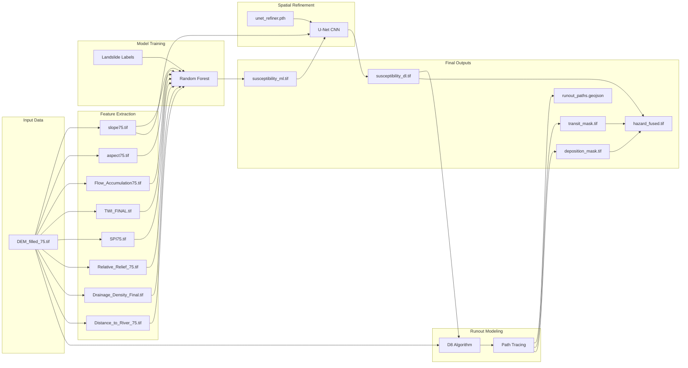

# SlipSense – System Architecture Walkthrough

This document provides detailed visual diagrams showing how every component of SlipSense interacts, from ML model training to frontend visualization.

> **Note**: The diagrams below use Mermaid syntax. They render automatically on GitHub, or in VS Code with the "Markdown Preview Mermaid Support" extension.

---

## Complete System Flow

```mermaid
flowchart TB
    subgraph DataSources["📂 Data Sources"]
        DEM["DEM (30m)"]
        Historical["Historical Landslides"]
        GSI["GSI/KSDMA Data"]
        Districts["District Boundaries"]
    end

    subgraph MLPipeline["🤖 ML/DL Pipeline"]
        Features["Feature Extraction"]
        RF["Random Forest Model"]
        UNET["U-Net Refinement"]
        D8["D8 Flow Direction"]
        Fusion["Hazard Fusion"]
    end

    subgraph Rasters["📊 Output Rasters"]
        ML_OUT["susceptibility_ml.tif"]
        DL_OUT["susceptibility_dl.tif"]
        HAZARD["hazard_fused.tif"]
        RUNOUT["runout_paths.geojson"]
    end

    subgraph Backend["⚙️ FastAPI Backend"]
        TILES["Tile Service"]
        PIXEL["Pixel API"]
        WEATHER["Weather Proxy"]
        ALERTS["Alert System"]
    end

    subgraph Frontend["🖥️ React Frontend"]
        LEAFLET["Leaflet Map"]
        CESIUM["Cesium 3D"]
        CONTROLS["Layer Controls"]
        INFO["Info Panels"]
    end

    DEM --> Features
    Historical --> RF
    Features --> RF
    RF --> ML_OUT
    ML_OUT --> UNET
    UNET --> DL_OUT
    DL_OUT --> D8
    D8 --> RUNOUT
    DL_OUT --> Fusion
    RUNOUT --> Fusion
    Fusion --> HAZARD
    GSI --> Rasters
    
    Rasters --> TILES
    Rasters --> PIXEL
    Districts --> ALERTS
    
    TILES --> LEAFLET
    PIXEL --> INFO
    WEATHER --> INFO
    ALERTS --> Backend
    
    LEAFLET --> CONTROLS
    LEAFLET --> CESIUM
    CONTROLS --> LEAFLET
```

---

## ML/DL Model Pipeline

### Feature Extraction Explanation

| Feature | Source | Calculation | Purpose |
|---------|--------|-------------|---------|
| Slope | DEM | Gradient magnitude | Steepness indicator |
| Aspect | DEM | Gradient direction | Sun exposure, moisture |
| Flow Accumulation | DEM | Upstream cell count | Drainage concentration |
| TWI | DEM + Slope | ln(FlowAcc / tan(slope)) | Soil moisture potential |
| SPI | DEM + Slope | FlowAcc × tan(slope) | Erosive power |
| Relative Relief | DEM | Local elevation range | Terrain ruggedness |
| Drainage Density | Flow network | Stream length / area | Channel intensity |
| Distance to River | Flow network | Euclidean distance | Proximity to drainage |

---

## Backend Architecture

---

## API Endpoint Flow

---

## Frontend Architecture

---

## Component Interaction Flow

---

## State Management

---

## Alert System Logic

```mermaid
flowchart TB
    START["Trigger Alert Check"]
    
    subgraph ForEachDistrict["For Each District"]
        LOAD["Load District Polygon"]
        SAMPLE["Sample 50 Random Points"]
        
        subgraph Checks["Threshold Checks"]
            SUS["Read DL Susceptibility"]
            HAZ["Check Hazard Zones"]
            RAIN["Fetch Rainfall Data"]
        end
        
        EVAL["Evaluate Conditions"]
        LEVEL["Determine Risk Level"]
    end

    subgraph Conditions["Alert Trigger Conditions"]
        C1["avg OR max susceptibility ≥ 0.75"]
        C2["rainfall ≥ 50mm/24hr"]
        C3["Contains Failure OR Transit zone"]
    end

    subgraph Actions["Alert Actions"]
        LOG["Log Alert"]
        SMS["Send SMS"]
        TRACK["Track Sent Alert"]
    end

    START --> LOAD --> SAMPLE
    SAMPLE --> SUS & HAZ & RAIN
    SUS & HAZ & RAIN --> EVAL
    EVAL --> C1 & C2 & C3
    C1 & C2 & C3 -->|ALL TRUE| LEVEL
    LEVEL -->|VERY HIGH| LOG --> SMS --> TRACK
    LEVEL -->|Other| LOG
```

---

## File Dependencies

---

## Data Flow Summary

| Source | Processing | Output | Consumer |
|--------|------------|--------|----------|
| DEM raster | Feature extraction | 9 derived rasters | ML model |
| Features + Labels | Random Forest training | susceptibility_ml.tif | U-Net input |
| ML output + Terrain | U-Net refinement | susceptibility_dl.tif | D8 model, Frontend |
| DL output + DEM | D8 flow tracing | runout_paths.geojson | Frontend |
| All outputs | Zone fusion | hazard_fused.tif | Frontend, Alerts |
| User click | Backend query | Pixel data | Info panel |
| Coordinates | OpenWeather API | Weather data | Navbar, Info panel |
| District polygons | Risk assessment | Alert decision | SMS service |

---

## How to View These Diagrams

### Option 1: GitHub (Recommended)
Push this file to GitHub - diagrams render automatically.

### Option 2: VS Code Extension
1. Install extension: **"Markdown Preview Mermaid Support"**
2. Open this file
3. Press `Ctrl+Shift+V` to preview

### Option 3: Online Viewer
Copy content to [mermaid.live](https://mermaid.live) to view individual diagrams.

---

*SlipSense – A terrain-aware approach to landslide hazard assessment for Kerala*
