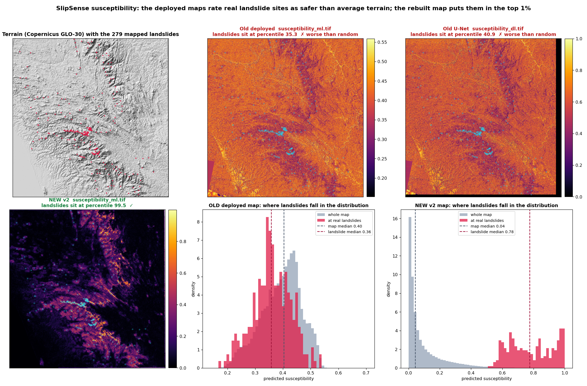
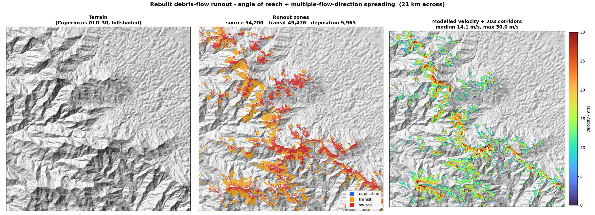

# SlipSense — Landslide Susceptibility & Runout for the Western Ghats

A terrain-aware landslide susceptibility, runout and alerting system, built on a 30 m
Copernicus DEM, ESA WorldCover vegetation and SoilGrids soils, and validated against
**42 landslide scars mapped independently from Sentinel-2 imagery**.

<p align="center">
  
</p>

## What the evidence actually says

| Claim | Evidence |
|---|---|
| The map ranks dangerous ground well | Independent satellite-mapped scars land in its **top quintile at 3.7× chance**, p = 2e-13 |
| It generalises beyond its training tile | Verified across **10 tiles** and **106 independent catalog events** |
| It is calibrated | ECE **0.040**; conformal coverage **0.901** against a 0.90 target |
| It knows what it does not know | **24%** of cells flagged ambiguous and shaded as such |
| The ML earns its complexity | **Not demonstrated.** A plain slope raster performs the same out of sample (paired p = 0.647, ML ahead on 21 of 42 scars) |

That last row is the honest headline, and it sits deliberately in the same table as the
good news. Full detail — including what was retracted and why — in
**[docs/MODEL_CARD.md](docs/MODEL_CARD.md)**.

> [!WARNING]
> **Earlier published figures are retracted.** F1 0.832 / Accuracy 85.6% /
> ROC-AUC 0.958 came from a dataset with **550 of 800 rows fabricated** by
> `np.random.uniform`, in which `elevation` and `dist_river` were generated *from the
> label* — so the single rule `dist_river < 1250` separated every synthetic row
> perfectly. The rasters feeding them were mislabelled too: `DEM_filled_75.tif` held
> slope in degrees rather than elevation, and `slope75.tif` was computed in EPSG:4326
> and pinned at 83–90° everywhere.
>
> The deployed map ranked real landslide sites at the **35th percentile** of its own
> distribution — worse than random. The rebuilt map places them at the **99.5th**.
> `data_preparation.py` and `enhanced_model.py` now refuse to run.

## Current results

Spatial-block cross-validation, 2,779 real samples, zero synthetic:

| Model | AUC | PR-AUC | Precision | Recall | F1 |
|---|---|---|---|---|---|
| **RandomForest** (17 features, deployed) | **0.895** | **0.636** | 0.645 | 0.541 | 0.589 |
| XGBoost | 0.892 | 0.609 | 0.689 | 0.470 | 0.559 |
| Patch CNN (display layer) | 0.896 | 0.593 | 0.556 | 0.556 | 0.556 |

`forest_fraction` is the single most important feature (+0.213), ahead of relative relief
(+0.202) — vegetation is signal a DEM structurally cannot contain. Landslide sites
average 0.57 forest cover against 0.84 for background.

**Rainfall triggering**, the temporal half: AUC 0.756, with 3-day antecedent rainfall of
**79 mm before failures against 30 mm on quiet days**.

**Alert tiers**, calibrated by how much terrain each one flags:

| Tier | Cutoff | Flags | Catches of inventory |
|---|---|---|---|
| WATCH | 0.374 | 5% of terrain | **100%** |
| HIGH | 0.619 | 1% | 84.9% |
| VERY HIGH | 0.869 | 0.2% | 32.6% |

## Coverage — read this before quoting the map

The model is trained on inventory from **one 1°×1° tile** (75–76°E, 12–13°N), which
intersects only **two** Kerala districts, Kasaragod and Kannur; 215 of the 279 inventory
points are in Karnataka. Prediction extends to **10 tiles** across the Western Ghats, and
those nine are extrapolation — scored against independent events, but not trained there.

The system **does not detect landslides**. It predicts susceptibility: which slopes
*could* fail. Detection from imagery exists only as the Sentinel-2 inventory pipeline.

<p align="center">
  
</p>

## What is in here

| Component | What it does |
|---|---|
| `ml_models/terrain.py` | Priority-Flood+ε fill, Horn slope/aspect, Zevenbergen–Thorne curvature, D8 accumulation, TWI/SPI |
| `ml_models/build_real_dataset.py` | Samples the real inventory against the real rasters, each in its own CRS |
| `ml_models/train_spatial_cv.py` | Spatial-block CV — random splits leak neighbouring cells |
| `ml_models/runout.py` | Angle-of-reach + multiple-flow-direction debris propagation with turbulent drag |
| `ml_models/sentinel_inventory.py` | Maps landslide scars from Sentinel-2 NDVI change |
| `ml_models/baseline_comparison.py` | The test that matters: ML vs slope vs relief vs published GSI |
| `ml_models/conformal.py` | Calibration and distribution-free uncertainty |
| `ml_models/physics_fos.py` | Infinite-slope factor of safety — a non-statistical second opinion |
| `ml_models/exposure.py` | Intersects runout corridors with OSM buildings and roads |
| `backend/` | FastAPI tile server, pixel queries, rainfall, district alerting |
| `frontend/` | React + Leaflet map with a Cesium 3D view |

## Running it

```bash
# Backend
cd backend
python -m pip install -r requirements.txt
python -m uvicorn app:app --reload --port 8000

# Frontend
cd frontend
npm install && npm run dev
```

Backend on `:8000`, frontend on `:5173`. Check `GET /health` first — it reports every
dependency, which rasters are present, and the exact command to fix what is missing.

### Configuration

Both files are optional; the app degrades rather than breaking.

```bash
# backend/.env
OPENWEATHER_API_KEY=      # rainfall reads 0.0 without it

# frontend/.env
VITE_CESIUM_ION_TOKEN=    # 3D falls back to open terrarium elevation without it
VITE_TILE_SERVER=http://localhost:8000
```

### Rebuilding the rasters

The generated stack is ~7 GB and gitignored, so a fresh clone has none:

```bash
python ml_models/build_terrain_stack.py       # terrain from the DEM
python ml_models/build_soil_layer.py          # SoilGrids 250 m
python ml_models/build_landcover_layer.py     # ESA WorldCover 10 m
python ml_models/build_real_dataset.py
python ml_models/train_spatial_cv.py
python ml_models/generate_susceptibility_v2.py
python ml_models/calibrate_alert_threshold.py
python ml_models/generate_runout_v2.py --threshold 0.619
```

Tests: `python -m pytest tests/ -v` — 21 tests, each pinning one of the defects that
produced the retracted results.

## Reports

| Report | Contents |
|---|---|
| [MODEL_CARD.md](docs/MODEL_CARD.md) | Intended use, data, limitations, retractions |
| [baseline_report.md](ml_models/baseline_report.md) | ML vs slope vs relief vs GSI |
| [sentinel_validation_report.md](ml_models/sentinel_validation_report.md) | Validation on satellite-mapped scars |
| [spatial_cv_report.md](ml_models/spatial_cv_report.md) | Cross-validated performance |
| [conformal_report.md](ml_models/conformal_report.md) | Calibration and uncertainty |
| [segmentation_report.md](ml_models/segmentation_report.md) | IoU/Dice, and why they are the wrong metric here |
| [rainfall_model_report.md](ml_models/rainfall_model_report.md) | Rainfall triggering |
| [coverage_report.md](ml_models/coverage_report.md) | Per-tile transfer |

## Known limitations

1. **The ML has not beaten a slope-and-relief index out of sample.** The burden of proof
   sits with the model, and it has not met it.
2. **Two districts, not fourteen.** Everything beyond the training tile is extrapolation.
3. **Inventory provenance is unknown** — the 279 points carry only an `id`, with no date,
   source or positional accuracy.
4. **The Sentinel scars are unverified** — NDVI loss also comes from logging and
   quarrying.
5. **Runout parameters are literature defaults**, not calibrated against local
   measurements.
6. **Factor of safety agrees with the ML on only 6%** of flagged cells; unresolved.

## Status

A research prototype and decision-support tool. **Not an operational warning system.**
Final authority rests with KSDMA and the Geological Survey of India.

---

## 1. Project Overview

### 1.1 Problem Statement

Kerala, India, experiences severe landslide events during monsoon seasons due to its unique combination of:
- Steep Western Ghats terrain
- High-intensity rainfall patterns
- Complex drainage networks
- Variable soil and geological conditions

Traditional landslide hazard mapping often relies on coarse-resolution assessments that fail to capture pixel-level terrain variations critical for accurate risk delineation.

### 1.2 Motivation and Objectives

SlipSense was developed to address the need for a **terrain-aware, pixel-level landslide susceptibility and runout prediction system** for Kerala. The primary objectives are:

1. Generate continuous susceptibility probability rasters using machine learning and deep learning models trained on DEM-derived geomorphometric features
2. Predict landslide runout paths using D8 flow direction analysis to identify not only initiation zones but also transit and deposition areas
3. Fuse multiple model outputs into a unified hazard zonation map
4. Provide an interactive web-based GIS interface for visualization and pixel-level inspection
5. Integrate real-time weather data to inform dynamic risk assessment
6. Enable district-wise emergency alert capabilities for decision support

### 1.3 Why Pixel-Level, Terrain-Aware Analysis

Unlike categorical or polygon-based hazard maps, SlipSense provides:
- **Continuous probability values** (0–1) at each raster pixel
- **Terrain-derived features** extracted directly from Digital Elevation Models (DEM)
- **Flow-based runout modeling** that traces the downhill movement path of potential landslides
- **Dynamic risk calculation** integrating susceptibility with real-time rainfall

---

## 2. System Architecture

### 2.1 High-Level Architecture

```
┌─────────────────────────────────────────────────────────────────────────────┐
│                              SLIPSENSE ARCHITECTURE                         │
├─────────────────────────────────────────────────────────────────────────────┤
│                                                                             │
│  ┌─────────────────┐    ┌─────────────────┐    ┌─────────────────────────┐  │
│  │   DATA SOURCES  │    │   ML/DL MODELS  │    │    GIS PROCESSING       │  │
│  ├─────────────────┤    ├─────────────────┤    ├─────────────────────────┤  │
│  │ • CartoDEM/SRTM │───▶│ • Random Forest │───▶│ • D8 Flow Direction     │  │
│  │ • DEM Derivatives│   │ • U-Net Refiner │    │ • Runout Path Tracing   │  │
│  │ • GSI Historical│    │                 │    │ • Hazard Zone Fusion    │  │
│  │ • District GeoJSON   │                 │    │                         │  │
│  └─────────────────┘    └─────────────────┘    └─────────────────────────┘  │
│           │                      │                        │                 │
│           ▼                      ▼                        ▼                 │
│  ┌──────────────────────────────────────────────────────────────────────┐   │
│  │                         RASTER OUTPUTS                               │   │
│  │  susceptibility_ml.tif │ susceptibility_dl.tif │ hazard_fused.tif    │   │
│  │  transit_mask.tif │ deposition_mask.tif │ runout_paths.geojson       │   │
│  └──────────────────────────────────────────────────────────────────────┘   │
│                                    │                                        │
│                                    ▼                                        │
│  ┌──────────────────────────────────────────────────────────────────────┐   │
│  │                        BACKEND (FastAPI)                             │   │
│  ├──────────────────────────────────────────────────────────────────────┤   │
│  │ • rio-tiler XYZ Tile Service (/tiles/{layer}/{z}/{x}/{y}.png)        │   │
│  │ • Pixel Inspection API (/pixel-info?lat=&lon=)                       │   │
│  │ • Weather Proxy (/weather?lat=&lon=)                                 │   │
│  │ • Alert System (/alerts/check, /alerts/trigger)                      │   │
│  │ • Static File Server (GeoJSON, rasters)                              │   │
│  └──────────────────────────────────────────────────────────────────────┘   │
│                                    │                                        │
│                                    ▼                                        │
│  ┌──────────────────────────────────────────────────────────────────────┐   │
│  │                     FRONTEND (React + Vite)                          │   │
│  ├──────────────────────────────────────────────────────────────────────┤   │
│  │ • LeafletJS 2D Map (ESRI Imagery basemap)                            │   │
│  │ • CesiumJS 3D Terrain Viewer (Google Photorealistic Tiles)           │   │
│  │ • Layer Control with Opacity Sliders                                 │   │
│  │ • Legend System                                                      │   │
│  │ • Pixel Inspector (hover + click)                                    │   │
│  │ • Weather Information Display                                        │   │
│  │ • Toast Notifications                                                │   │
│  └──────────────────────────────────────────────────────────────────────┘   │
│                                                                             │
└─────────────────────────────────────────────────────────────────────────────┘
```

### 2.2 Layer Separation

| Layer | Description | Technologies |
|-------|-------------|--------------|
| **Data Sources** | DEM, derived rasters, historical data, boundaries | GeoTIFF, GeoJSON |
| **ML/DL Models** | Susceptibility prediction and spatial refinement | Random Forest, U-Net |
| **GIS Processing** | Flow direction, runout modeling, hazard fusion | GDAL, rasterio, numpy |
| **Backend APIs** | Tile serving, pixel queries, weather, alerts | FastAPI, rio-tiler, rasterio |
| **Frontend** | Interactive map visualization | React, Leaflet, Cesium, Framer Motion |

---

## 3. Model Architecture and Explanation

### Module 1: Machine Learning Susceptibility Model

**Algorithm**: Random Forest classifier/regressor trained on labeled landslide/non-landslide pixels

**Input Features** (DEM-derived):
| Feature | Description |
|---------|-------------|
| Elevation | Raw DEM values (filled) |
| Slope | Terrain gradient in degrees |
| Aspect | Slope facing direction |
| Flow Accumulation | Upstream contributing area |
| Topographic Wetness Index (TWI) | Soil moisture potential |
| Stream Power Index (SPI) | Erosive power of flowing water |
| Relative Relief | Local elevation range |
| Drainage Density | Stream network intensity |
| Distance to River | Proximity to drainage channels |

**Output**: `susceptibility_ml.tif` – Continuous probability raster (0–1) indicating landslide likelihood at each pixel.

**Interpretation**: Higher values indicate terrain conditions more favorable to landslide initiation based on learned patterns from training data.

---

### Module 2: Deep Learning Spatial Refinement

**Model Type**: U-Net convolutional neural network

**Purpose**: Refine the ML susceptibility output by incorporating spatial context and enforcing coherent boundaries between risk zones.

**Input Channels**:
1. ML susceptibility raster
2. Additional terrain features (slope, TWI, etc.)

**Output**: `susceptibility_dl.tif` – Spatially refined susceptibility raster with improved boundary delineation and noise reduction.

**Rationale**: While the ML model provides pixel-wise predictions, U-Net-based refinement leverages encoder-decoder architecture to capture multi-scale spatial dependencies, producing smoother and more geologically plausible hazard boundaries.

The trained model weights are stored in `backend/rasters/unet_refiner.pth`.

---

### Module 3: D8 Flow Direction & Runout Model

**Algorithm**: D8 (Deterministic 8-neighbor) flow direction

**Process**:
1. **Flow Direction Computation**: For each DEM pixel, determine the direction of steepest descent among 8 neighbors
2. **Flow Accumulation**: Count upstream contributing pixels
3. **Source Identification**: High-susceptibility pixels in failure zones serve as runout starting points
4. **Path Tracing**: Follow flow direction from failure zones downhill until reaching flat terrain or water bodies

**Outputs**:
- `transit_mask.tif` – Raster identifying transit zones (paths of debris movement)
- `deposition_mask.tif` – Raster identifying deposition zones (areas of material accumulation)
- `runout_paths.geojson` – Vector line features representing traced runout trajectories

**Significance**: Runout modeling extends hazard assessment beyond initiation zones to identify downstream areas at risk from debris flow.

---

### Module 4: Fusion & Hazard Zoning

**Process**: Combine outputs from ML, DL, and D8 models into a unified hazard classification.

**Hazard Zone Classification** (stored in `hazard_fused.tif`):

| Code | Zone | Description |
|------|------|-------------|
| 0 | Safe | Low susceptibility, not in runout path |
| 1 | Deposition | Area of debris accumulation |
| 2 | Transit | Path of debris movement |
| 3 | Failure | High susceptibility initiation zone |

**Fusion Logic**:
- Pixels with high DL susceptibility (≥ threshold) are classified as Failure zones
- D8-traced paths overlaying lower susceptibility become Transit zones
- Terminal points of runout paths become Deposition zones

---

## 4. Datasets Used

| Dataset | Source | Resolution | Format | Approx. Size |
|---------|--------|------------|--------|--------------|
| DEM (filled) | CartoDEM / SRTM | 30m | GeoTIFF | ~51 MB |
| Slope | Derived from DEM | 30m | GeoTIFF | ~52 MB |
| Aspect | Derived from DEM | 30m | GeoTIFF | ~52 MB |
| Flow Accumulation | Derived from DEM | 30m | GeoTIFF | ~52 MB |
| TWI (Topographic Wetness Index) | Derived | 30m | GeoTIFF | ~52 MB |
| SPI (Stream Power Index) | Derived | 30m | GeoTIFF | ~52 MB |
| Relative Relief | Derived | 30m | GeoTIFF | ~52 MB |
| Drainage Density | Derived | 30m | GeoTIFF | ~52 MB |
| Distance to River | Derived | 30m | GeoTIFF | ~52 MB |
| Historical Susceptibility | GSI/KSDMA 2022 | Variable | GeoTIFF | ~6 MB |
| District Boundaries | Kerala State | Vector | GeoJSON | ~1.8 MB |
| Historical Landslide Records | KSDMA, Global Catalog | Point data | CSV | ~8 MB |
| Weather Data | OpenWeather API | Real-time | JSON | N/A |

---

## 5. Modules Implemented and Results

| Module | Output | Status | Description |
|--------|--------|--------|-------------|
| ML Susceptibility Model | `susceptibility_ml.tif` | ✅ Completed | Random Forest probability raster |
| DL Spatial Refinement | `susceptibility_dl.tif` | ✅ Completed | U-Net refined susceptibility |
| D8 Runout Model | `runout_paths.geojson`, `transit_mask.tif`, `deposition_mask.tif` | ✅ Completed | Flow-based runout trajectories |
| Hazard Fusion | `hazard_fused.tif` | ✅ Completed | Unified zone classification |
| Backend Tile Server | FastAPI + rio-tiler | ✅ Completed | XYZ tile generation |
| Pixel Inspection API | `/pixel-info` endpoint | ✅ Completed | Query susceptibility at coordinates |
| Weather Integration | `/weather` endpoint | ✅ Completed | OpenWeather API proxy |
| SMS Alert System | `/alerts/*` endpoints | ✅ Completed | District-wise risk alerts |
| Frontend GIS Dashboard | React + Leaflet + Cesium | ✅ Completed | Interactive visualization |

**Qualitative Observations**:
- The DL-refined susceptibility shows improved spatial coherence compared to pixel-wise ML output
- Runout paths follow geologically plausible drainage patterns
- Hazard zones correctly distinguish initiation, transit, and deposition areas
- Real-time weather integration provides dynamic risk context

---

## 6. Frontend Architecture

### 6.1 Base Map
- **Provider**: ESRI World Imagery via ArcGIS REST services
- **Library**: LeafletJS with react-leaflet bindings

### 6.2 Raster Tile Overlays
The following layers are served as XYZ tiles via the backend:

| Layer Key | Display Name | Description |
|-----------|--------------|-------------|
| `susceptibilityML` | ML Susceptibility | Raw ML probability output |
| `susceptibilityDL` | DL Refined Susceptibility | U-Net refined output |
| `historicalSusceptibility` | GSI Historical | KSDMA/GSI 2022 data |
| `hazardFused` | Final Hazard Map | Fused zone classification |
| `transit` | Transit Zone | Movement path mask |
| `deposition` | Deposition Zone | Accumulation area mask |

### 6.3 Vector Overlays
- **Runout Paths**: GeoJSON line features with interactive hover/click
- **District Boundaries**: Kerala district polygons (selectable filter)

### 6.4 Interactive Features
| Feature | Description |
|---------|-------------|
| Layer Toggle | Enable/disable individual layers |
| Opacity Sliders | Adjust transparency per layer |
| Pixel Inspector (Click) | Query backend for susceptibility, zone, and risk at clicked location |
| Pixel Inspector (Hover) | Real-time tooltip with zone and susceptibility values |
| Weather Display | Current temperature, humidity, rainfall at location |
| 3D Terrain View | Cesium modal with Google Photorealistic 3D Tiles |
| Toast Notifications | User feedback for layer changes and data loading |
| Legend Panel | Color coding for zones and susceptibility gradient |

### 6.5 District Filter
For historical susceptibility layer, users can filter by individual Kerala districts to view district-specific GSI data.

---

## 7. Backend Architecture

### 7.1 FastAPI Service

**Entry Point**: `backend/app.py`

**Endpoints**:

| Endpoint | Method | Description |
|----------|--------|-------------|
| `/` | GET | Health check |
| `/tiles/{layer}/{z}/{x}/{y}.png` | GET | XYZ tile for specified layer |
| `/pixel-info` | GET | Query susceptibility and zone at lat/lon |
| `/weather` | GET | Proxy to OpenWeather API |
| `/alerts/check` | GET | Check risk levels for all districts |
| `/alerts/trigger` | POST | Trigger SMS alerts for high-risk districts |
| `/alerts/status` | GET | View sent alerts and configuration |
| `/alerts/test` | GET | Test alert system configuration |
| `/rasters/*` | Static | Serve GeoJSON and static files |

### 7.2 Tile Generation (rio-tiler)

The tile service uses `rio-tiler` with `COGReader` to generate PNG tiles from Cloud-Optimized GeoTIFFs on-the-fly:

- Single-band rasters are normalized to 0–255 grayscale
- Multi-class hazard raster uses custom colorization:
  - Failure (3): Red `#dc2626`
  - Transit (2): Orange `#ffa500`
  - Deposition (1): Yellow `#ffff00`
  - Safe (0): Transparent/Black
- Historical susceptibility uses RGBA with transparency for NoData

### 7.3 Pixel Inspection API

`/pixel-info?lat={lat}&lon={lon}` returns:
```json
{
  "latitude": 12.5,
  "longitude": 75.0,
  "zone": "Failure|Transit|Deposition|Safe",
  "susceptibility": 0.782,
  "historical_susceptibility": 4,
  "historical_risk_class": "High|Moderate|Low",
  "rainfall": 2.5,
  "riskLevel": "High|Moderate|Low"
}
```

Risk level is computed as: `susceptibility × (1 + rainfall/20)`

### 7.4 SMS Alert System

**Trigger Conditions** (all must be true):
1. Average OR maximum DL susceptibility ≥ 0.75 in district
2. Rainfall ≥ 50mm in last 24 hours
3. District contains Failure or Transit zones

**Providers Supported**:
- Twilio (international)
- Fast2SMS (free tier for India, 20 SMS/day)

**Configuration** (via environment variables):
- `SMS_PROVIDER`: "twilio" or "fast2sms"
- `DRY_RUN`: "true" to log without sending
- `ALERT_RECIPIENTS`: Comma-separated phone numbers

---

## 8. Project Limitations

> The five limitations below were written for the original system. Four further ones
> emerged from the rebuild and matter more than any of them. Full detail in
> [MODEL_CARD.md](docs/MODEL_CARD.md).
>
> **A. Model coverage is two districts, not fourteen.** The inventory used for training
> lies entirely inside one 1°×1° tile intersecting only Kasaragod and Kannur; 215 of the
> 279 points are outside Kerala altogether. Prediction has since been extended to 10
> tiles across the Western Ghats, but those nine are extrapolation.
>
> **B. The system does not detect landslides.** It predicts susceptibility — which
> slopes *could* fail. Detection of failures that have already happened is a separate
> capability, now prototyped via Sentinel-2 change detection but not part of the app.
>
> **C. The machine learning does not beat a plain slope raster out of sample.** Against
> 42 independent satellite-mapped scars, slope alone reaches the 88.0th percentile and
> the trained model 84.9th. The *map* is good — scars land in its top quintile at 3.7×
> chance, p = 2e-13 — but the ML component is not yet justified over a simple
> slope-and-relief index.
>
> **D. Earlier published metrics are retracted.** F1 0.832 / ROC-AUC 0.958 came from a
> dataset with 550 of 800 rows fabricated and two features derived from the label, fed
> by rasters whose contents did not match their names.

1. **DEM Resolution Dependency**: Results are constrained by 30m SRTM/CartoDEM resolution; sub-meter terrain features are not captured

2. **Rainfall Threshold Assumptions**: The 50mm/24hr threshold is a heuristic; actual triggering rainfall varies by geology and antecedent moisture

3. **Advisory Nature**: Outputs are for decision-support only; final authority lies with official disaster management agencies (KSDMA, NDMA)

4. **District-Level Aggregation**: Alert system aggregates at district level; panchayat-level granularity is not currently supported

5. **Static Training Data**: Models are trained on historical events; emerging patterns from climate change may not be fully captured

6. **Network Dependency**: Weather integration and alerts require internet connectivity

7. **Validation Scope**: Model outputs have not undergone formal field validation with ground-truth surveys

---

## 9. Future Scope

1. **Higher-Resolution DEM**: Integrate LiDAR or 10m DEM for improved micro-terrain analysis

2. **Real-Time Rainfall Ingestion**: Connect to IMD AWS network for continuous rainfall monitoring

3. **Mobile Alert Integration**: Push notifications via mobile apps in addition to SMS

4. **Panchayat-Level Zoning**: Downscale alerts and analysis to local administrative units

5. **Temporal Landslide Forecasting**: Incorporate antecedent rainfall indices and soil moisture for time-dependent predictions

6. **Field Validation**: Systematic ground-truth surveys at predicted high-risk locations

7. **Multi-Hazard Integration**: Combine with flood and earthquake susceptibility for comprehensive risk assessment

8. **User Feedback Loop**: Allow local authorities to report events and improve model training

---

## 10. References

- Geological Survey of India (GSI) Landslide Susceptibility Maps
- Kerala State Disaster Management Authority (KSDMA) Data
- CartoDEM / SRTM Digital Elevation Models
- OpenWeather API Documentation
- rio-tiler Documentation
- Leaflet and CesiumJS Documentation

---

## License

This project is developed as an academic final-year project. It is intended for educational and research purposes. For any operational use, proper authorization from relevant authorities is required.

---

*SlipSense – A terrain-aware approach to landslide hazard assessment for Kerala*
