# SlipSense – Complete System Architecture

> A terrain-aware landslide hazard assessment system for Kerala, India

---

## High-Level System Overview

```mermaid
%%{init: {'theme': 'base', 'themeVariables': { 'fontSize': '20px', 'primaryColor': '#4F46E5', 'primaryTextColor': '#fff', 'primaryBorderColor': '#3730A3', 'lineColor': '#6366F1', 'secondaryColor': '#F59E0B', 'tertiaryColor': '#10B981'}}}%%
flowchart TB
    subgraph ROW1[" "]
        direction LR
        subgraph DATA["📂 DATA LAYER"]
            DEM["🗺️ DEM Rasters"]
            HIST["📊 Historical Data"]
            GEO["🌍 GeoJSON Boundaries"]
        end

        subgraph ML["🤖 ML/DL PIPELINE"]
            RF["🌲 Random Forest"]
            UNET["🧠 U-Net CNN"]
            D8["📐 D8 Flow Algorithm"]
        end
    end

    subgraph ROW2[" "]
        direction LR
        subgraph OUTPUT["📊 OUTPUT RASTERS"]
            SUS["susceptibility_dl.tif"]
            HAZ["hazard_fused.tif"]
            RUN["runout_paths.geojson"]
        end

        subgraph BACKEND["⚙️ FASTAPI BACKEND"]
            TILES["🖼️ Tile Service"]
            PIXEL["📍 Pixel Query API"]
            ALERTS["🚨 Alert System"]
        end
    end

    subgraph ROW3[" "]
        direction LR
        subgraph FRONTEND["🖥️ REACT FRONTEND"]
            LEAFLET["🗺️ Leaflet 2D Map"]
            CESIUM["🌐 Cesium 3D View"]
            UI["🎛️ Controls & Panels"]
        end

        subgraph EXTERNAL["🌐 EXTERNAL SERVICES"]
            WEATHER["☁️ OpenWeather API"]
            SMS["📱 Twilio SMS"]
        end
    end

    DATA ==> ML
    ML ==> OUTPUT
    OUTPUT ==> BACKEND
    BACKEND ==> FRONTEND
    EXTERNAL <-.-> BACKEND

    style ROW1 fill:none,stroke:none
    style ROW2 fill:none,stroke:none
    style ROW3 fill:none,stroke:none
    style DATA fill:#E0E7FF,stroke:#4F46E5,stroke-width:4px
    style ML fill:#FEF3C7,stroke:#F59E0B,stroke-width:4px
    style OUTPUT fill:#D1FAE5,stroke:#10B981,stroke-width:4px
    style BACKEND fill:#FEE2E2,stroke:#EF4444,stroke-width:4px
    style FRONTEND fill:#DBEAFE,stroke:#3B82F6,stroke-width:4px
    style EXTERNAL fill:#F3E8FF,stroke:#8B5CF6,stroke-width:4px
```

> 📥 **Download**: Open in [Mermaid Live Editor](https://mermaid.live) → Click "Actions" → "Download PNG/SVG"

---

## System Components Summary

| Component | Technology | Purpose |
|-----------|------------|---------|
| **Data Layer** | GeoTIFF, GeoJSON | Raw terrain and boundary data |
| **ML Pipeline** | Python, scikit-learn, PyTorch | Landslide susceptibility prediction |
| **Backend** | FastAPI, rio-tiler, rasterio | API services and tile generation |
| **Frontend** | React, Leaflet, CesiumJS | Interactive web visualization |
| **External** | OpenWeather, Twilio | Weather data and SMS alerts |

---

## Data Flow Direction

```mermaid
%%{init: {'theme': 'base', 'themeVariables': { 'fontSize': '20px'}}}%%
flowchart LR
    A["📂<br/>Raw Data"] --> B["🤖<br/>ML Processing"]
    B --> C["📊<br/>Raster Outputs"]
    C --> D["⚙️<br/>Backend APIs"]
    D --> E["🖥️<br/>Frontend UI"]
    
    style A fill:#E0E7FF,stroke:#4F46E5,stroke-width:4px,color:#1E1B4B
    style B fill:#FEF3C7,stroke:#F59E0B,stroke-width:4px,color:#78350F
    style C fill:#D1FAE5,stroke:#10B981,stroke-width:4px,color:#064E3B
    style D fill:#FEE2E2,stroke:#EF4444,stroke-width:4px,color:#7F1D1D
    style E fill:#DBEAFE,stroke:#3B82F6,stroke-width:4px,color:#1E3A8A
```

> 📥 **Download**: Open in [Mermaid Live Editor](https://mermaid.live) → Click "Actions" → "Download PNG/SVG"

---

*See individual architecture documents for detailed component breakdowns.*
