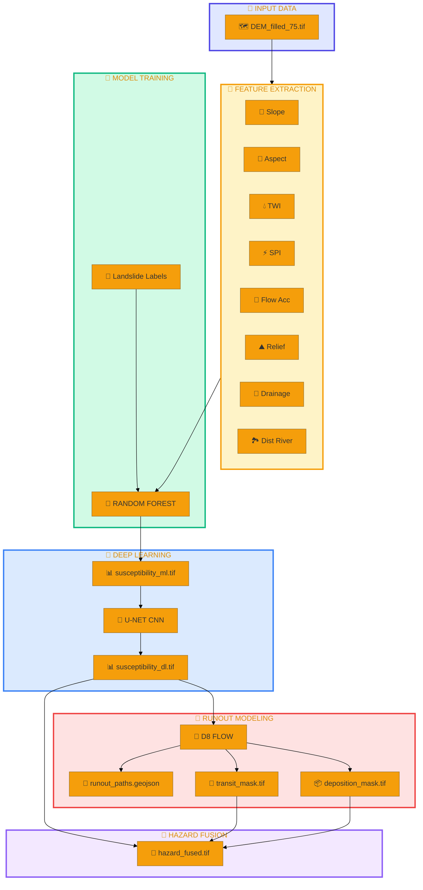
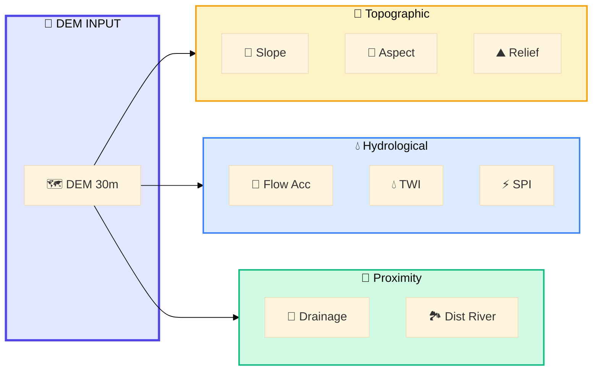

# SlipSense – ML/DL Model Architecture

> [!WARNING]
> **Some figures in this document are retracted.** Any mention of F1 0.832,
> Accuracy 85.6%, ROC-AUC 0.958, or coverage of "all 14 districts" is invalid.
> Those metrics came from a dataset with 550 of 800 rows fabricated and two features
> derived from the label; the terrain rasters feeding them were also mislabelled
> (`DEM_filled_75.tif` held slope, not elevation).
>
> Current, verified results: [MODEL_CARD.md](MODEL_CARD.md).
> Key correction: the model is trained on one tile covering **2** Kerala districts,
> and out of sample it does **not** beat relative relief alone.

> Machine Learning and Deep Learning Pipeline for Landslide Susceptibility Prediction

---

## ML Pipeline Overview

```mermaid
%%{init: {'theme': 'base', 'themeVariables': { 'fontSize': '16px', 'primaryColor': '#F59E0B'}}}%%
flowchart TB
    subgraph INPUT["📂 INPUT DATA"]
        DEM["🗺️ DEM_filled_75.tif"]
    end

    subgraph FEATURES["🔬 FEATURE EXTRACTION"]
        F1["📐 Slope"]
        F2["🧭 Aspect"]
        F3["💧 TWI"]
        F4["⚡ SPI"]
        F5["🌊 Flow Acc"]
        F6["⛰️ Relief"]
        F7["🔀 Drainage"]
        F8["🏞️ Dist River"]
    end

    subgraph TRAINING["🎯 MODEL TRAINING"]
        LABELS["📍 Landslide Labels"]
        RF["🌲 RANDOM FOREST"]
    end

    subgraph REFINEMENT["🧠 DEEP LEARNING"]
        ML_OUT["📊 susceptibility_ml.tif"]
        UNET["🧠 U-NET CNN"]
        DL_OUT["📊 susceptibility_dl.tif"]
    end

    subgraph RUNOUT["📐 RUNOUT MODELING"]
        D8["📐 D8 FLOW"]
        PATHS["📍 runout_paths.geojson"]
        TRANSIT["🚸 transit_mask.tif"]
        DEPO["📦 deposition_mask.tif"]
    end

    subgraph FUSION["🔗 HAZARD FUSION"]
        FUSED["🎯 hazard_fused.tif"]
    end

    DEM --> FEATURES
    FEATURES --> RF
    LABELS --> RF
    RF --> ML_OUT
    
    ML_OUT --> UNET
    UNET --> DL_OUT
    
    DL_OUT --> D8
    D8 --> PATHS
    D8 --> TRANSIT
    D8 --> DEPO
    
    DL_OUT --> FUSED
    TRANSIT --> FUSED
    DEPO --> FUSED

    style INPUT fill:#E0E7FF,stroke:#4F46E5,stroke-width:3px
    style FEATURES fill:#FEF3C7,stroke:#F59E0B,stroke-width:3px
    style TRAINING fill:#D1FAE5,stroke:#10B981,stroke-width:3px
    style REFINEMENT fill:#DBEAFE,stroke:#3B82F6,stroke-width:3px
    style RUNOUT fill:#FEE2E2,stroke:#EF4444,stroke-width:3px
    style FUSION fill:#F3E8FF,stroke:#8B5CF6,stroke-width:3px
```

> 📥 **Download**: Open in [Mermaid Live Editor](https://mermaid.live) → Click "Actions" → "Download PNG/SVG"

---

## Feature Extraction Details

```mermaid
%%{init: {'theme': 'base', 'themeVariables': { 'fontSize': '16px'}}}%%
flowchart LR
    subgraph DEM_INPUT["📂 DEM INPUT"]
        DEM["🗺️ DEM 30m"]
    end

    subgraph TOPO["📐 Topographic"]
        SLOPE["📐 Slope"]
        ASPECT["🧭 Aspect"]
        RELIEF["⛰️ Relief"]
    end
    
    subgraph HYDRO["💧 Hydrological"]
        FLOW["🌊 Flow Acc"]
        TWI["💧 TWI"]
        SPI["⚡ SPI"]
    end
    
    subgraph PROX["📍 Proximity"]
        DRAIN["🔀 Drainage"]
        RIVER["🏞️ Dist River"]
    end

    DEM --> TOPO
    DEM --> HYDRO
    DEM --> PROX

    style DEM_INPUT fill:#E0E7FF,stroke:#4F46E5,stroke-width:3px
    style TOPO fill:#FEF3C7,stroke:#F59E0B,stroke-width:2px
    style HYDRO fill:#DBEAFE,stroke:#3B82F6,stroke-width:2px
    style PROX fill:#D1FAE5,stroke:#10B981,stroke-width:2px
```

> 📥 **Download**: Open in [Mermaid Live Editor](https://mermaid.live) → Click "Actions" → "Download PNG/SVG"

---

## Model Files Summary

| File | Type | Purpose | Size |
|------|------|---------|------|
| `landslide_model.pkl` | Random Forest | Primary susceptibility classifier | ~2.5 MB |
| `landslide_model_xgb.pkl` | XGBoost | Alternative classifier | ~644 KB |
| `unet_refiner.pth` | U-Net CNN | Spatial refinement model | - |

---

## Processing Pipeline Steps

```mermaid
%%{init: {'theme': 'base', 'themeVariables': { 'fontSize': '20px'}}}%%
flowchart LR
    A["1️⃣ Load DEM"] --> B["2️⃣ Extract Features"]
    B --> C["3️⃣ Random Forest"]
    C --> D["4️⃣ U-Net Refinement"]
    D --> E["5️⃣ D8 Runout"]
    E --> F["6️⃣ Hazard Fusion"]

    style A fill:#E0E7FF,stroke:#4F46E5,stroke-width:4px
    style B fill:#FEF3C7,stroke:#F59E0B,stroke-width:4px
    style C fill:#D1FAE5,stroke:#10B981,stroke-width:4px
    style D fill:#DBEAFE,stroke:#3B82F6,stroke-width:4px
    style E fill:#FEE2E2,stroke:#EF4444,stroke-width:4px
    style F fill:#F3E8FF,stroke:#8B5CF6,stroke-width:4px
```

> 📥 **Download**: Open in [Mermaid Live Editor](https://mermaid.live) → Click "Actions" → "Download PNG/SVG"

---

## Key Scripts

| Script | Purpose |
|--------|---------|
| `train_models.py` | Train Random Forest classifier |
| `generate_susceptibility_map.py` | Generate ML susceptibility output |
| `unet_refine.py` | Apply U-Net refinement |
| `generate_runout_and_fuse.py` | D8 flow tracing and hazard fusion |

---

*Part of the SlipSense Architecture Documentation*
