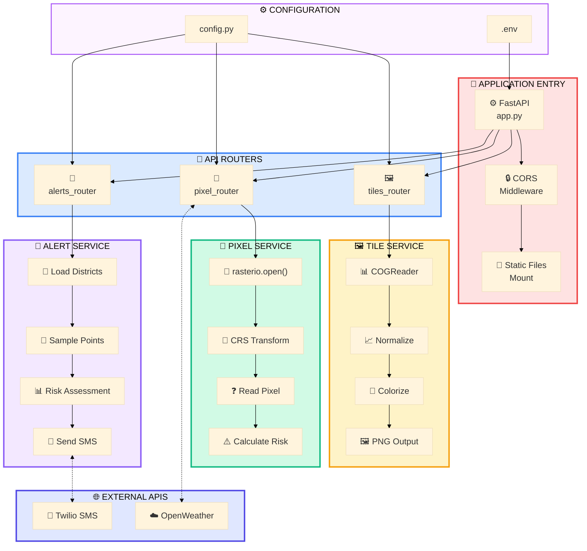
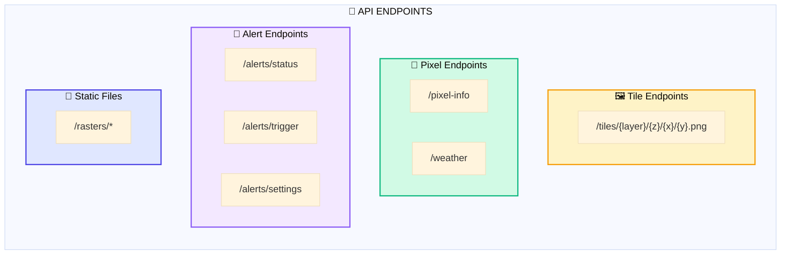
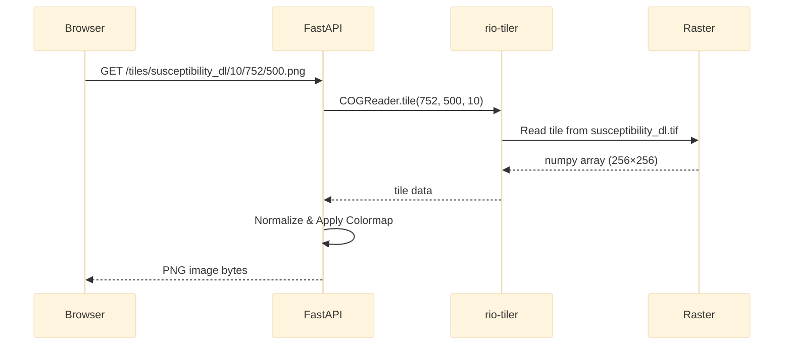
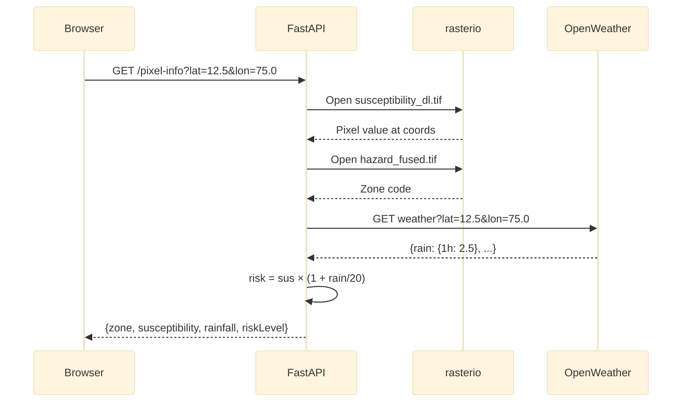
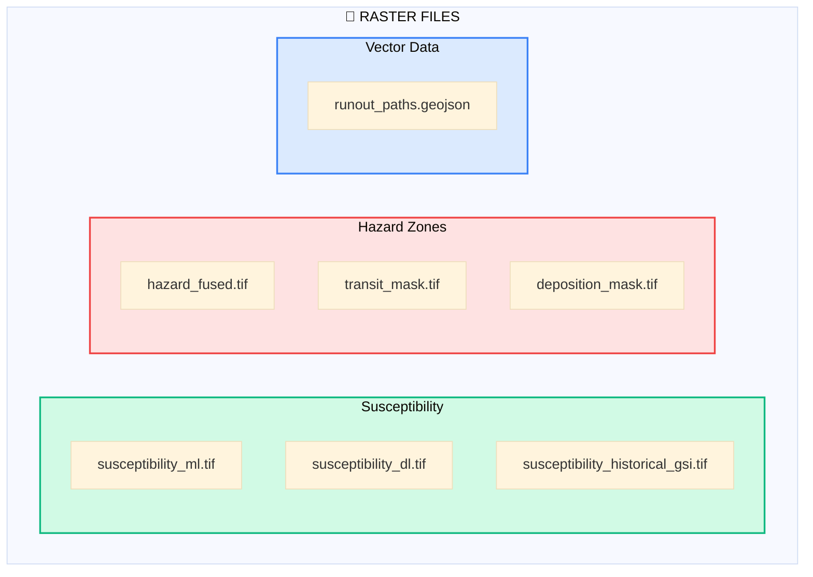

# SlipSense – Backend Architecture

> FastAPI-based REST API for tile serving, pixel queries, and alert management

---

## Backend Overview

> 📥 **Download**: Open in [Mermaid Live Editor](https://mermaid.live) → Click "Actions" → "Download PNG/SVG"

---

## API Endpoints

> 📥 **Download**: Open in [Mermaid Live Editor](https://mermaid.live) → Click "Actions" → "Download PNG/SVG"

---

## Request Flow: Tile Request

> 📥 **Download**: Open in [Mermaid Live Editor](https://mermaid.live) → Click "Actions" → "Download PNG/SVG"

---

## Request Flow: Pixel Query

> 📥 **Download**: Open in [Mermaid Live Editor](https://mermaid.live) → Click "Actions" → "Download PNG/SVG"

---

## Backend Files

| File | Purpose | Key Functions |
|------|---------|---------------|
| `app.py` | Application entry | FastAPI setup, router mounting |
| `config.py` | Configuration | Raster paths, thresholds |
| `tiles.py` | Tile service | COG reading, colorization |
| `pixel.py` | Pixel queries | Coordinate lookup, risk calculation |
| `alerts.py` | Alert system | SMS triggers, district sampling |

---

## Raster Files Served

> 📥 **Download**: Open in [Mermaid Live Editor](https://mermaid.live) → Click "Actions" → "Download PNG/SVG"

---

*Part of the SlipSense Architecture Documentation*
