# SlipSense – Backend Architecture

> FastAPI-based REST API for tile serving, pixel queries, and alert management

---

## Backend Overview

> 📥 **Download**: Open in [Mermaid Live Editor](https://mermaid.live) → Click "Actions" → "Download PNG/SVG"

---

## API Endpoints

```mermaid
%%{init: {'theme': 'base', 'themeVariables': { 'fontSize': '16px'}}}%%
flowchart LR
    subgraph ENDPOINTS["📡 API ENDPOINTS"]
        direction TB
        
        subgraph TILES["🖼️ Tile Endpoints"]
            T1["/tiles/{layer}/{z}/{x}/{y}.png"]
        end
        
        subgraph PIXEL["📍 Pixel Endpoints"]
            P1["/pixel-info"]
            P2["/weather"]
        end
        
        subgraph ALERTS["🚨 Alert Endpoints"]
            A1["/alerts/status"]
            A2["/alerts/trigger"]
            A3["/alerts/settings"]
        end
        
        subgraph STATIC["📁 Static Files"]
            S1["/rasters/*"]
        end
    end

    style TILES fill:#FEF3C7,stroke:#F59E0B,stroke-width:2px
    style PIXEL fill:#D1FAE5,stroke:#10B981,stroke-width:2px
    style ALERTS fill:#F3E8FF,stroke:#8B5CF6,stroke-width:2px
    style STATIC fill:#E0E7FF,stroke:#4F46E5,stroke-width:2px
```

> 📥 **Download**: Open in [Mermaid Live Editor](https://mermaid.live) → Click "Actions" → "Download PNG/SVG"

---

## Request Flow: Tile Request

> 📥 **Download**: Open in [Mermaid Live Editor](https://mermaid.live) → Click "Actions" → "Download PNG/SVG"

---

## Request Flow: Pixel Query

```mermaid
%%{init: {'theme': 'base', 'themeVariables': { 'fontSize': '16px'}}}%%
sequenceDiagram
    participant Browser
    participant FastAPI
    participant rasterio
    participant OpenWeather

    Browser->>FastAPI: GET /pixel-info?lat=12.5&lon=75.0
    FastAPI->>rasterio: Open susceptibility_dl.tif
    rasterio-->>FastAPI: Pixel value at coords
    FastAPI->>rasterio: Open hazard_fused.tif
    rasterio-->>FastAPI: Zone code
    FastAPI->>OpenWeather: GET weather?lat=12.5&lon=75.0
    OpenWeather-->>FastAPI: {rain: {1h: 2.5}, ...}
    FastAPI->>FastAPI: risk = sus × (1 + rain/20)
    FastAPI-->>Browser: {zone, susceptibility, rainfall, riskLevel}
```

> 📥 **Download**: Open in [Mermaid Live Editor](https://mermaid.live) → Click "Actions" → "Download PNG/SVG"

---

## Backend Files

| File | Purpose | Key Functions |
|------|---------|---------------|
| `app.py` | Application entry | FastAPI setup, router mounting |
| `config.py` | Configuration | Raster paths, thresholds |
| `tiles.py` | Tile service | COG reading, colorization |
| `pixel.py` | Pixel queries | Coordinate lookup, risk calculation |
| `alerts.py` | Alert system | SMS triggers, district sampling |

---

## Raster Files Served

```mermaid
%%{init: {'theme': 'base', 'themeVariables': { 'fontSize': '16px'}}}%%
flowchart TB
    subgraph RASTERS["📂 RASTER FILES"]
        direction LR
        
        subgraph SUS["Susceptibility"]
            ML["susceptibility_ml.tif"]
            DL["susceptibility_dl.tif"]
            HIST["susceptibility_historical_gsi.tif"]
        end
        
        subgraph HAZ["Hazard Zones"]
            FUSED["hazard_fused.tif"]
            TRANS["transit_mask.tif"]
            DEPO["deposition_mask.tif"]
        end
        
        subgraph PATHS["Vector Data"]
            RUN["runout_paths.geojson"]
        end
    end

    style SUS fill:#D1FAE5,stroke:#10B981,stroke-width:2px
    style HAZ fill:#FEE2E2,stroke:#EF4444,stroke-width:2px
    style PATHS fill:#DBEAFE,stroke:#3B82F6,stroke-width:2px
```

> 📥 **Download**: Open in [Mermaid Live Editor](https://mermaid.live) → Click "Actions" → "Download PNG/SVG"

---

*Part of the SlipSense Architecture Documentation*
