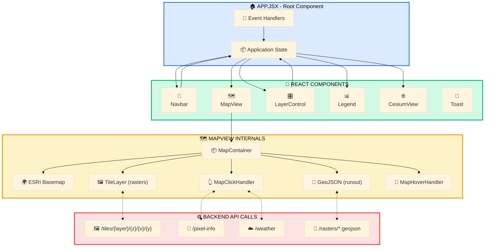
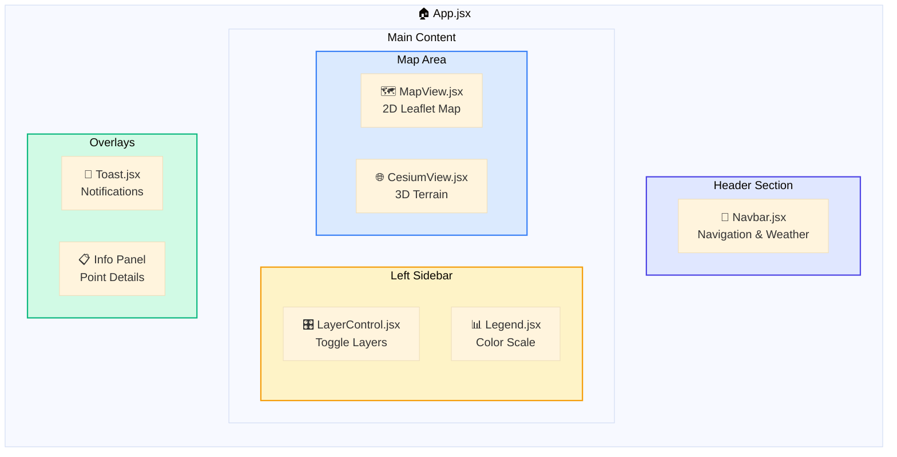
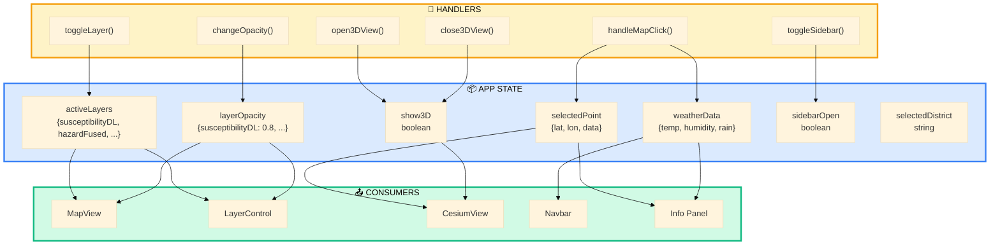
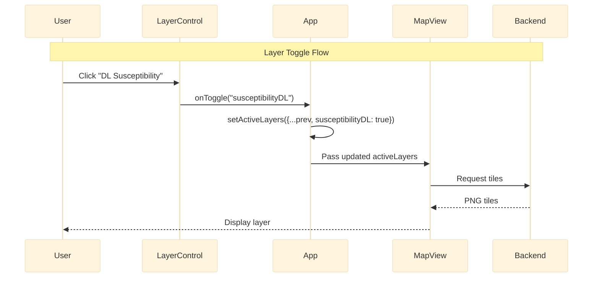
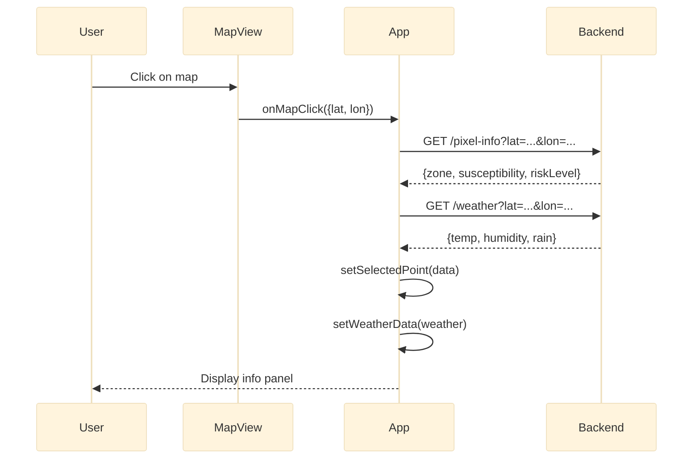
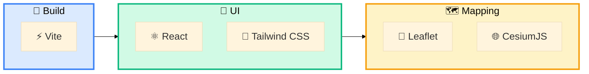

# SlipSense – Frontend Architecture

> React-based interactive web application with 2D and 3D visualization

---

## Frontend Overview

> 📥 **Download**: Open in [Mermaid Live Editor](https://mermaid.live) → Click "Actions" → "Download PNG/SVG"

---

## Component Hierarchy

> 📥 **Download**: Open in [Mermaid Live Editor](https://mermaid.live) → Click "Actions" → "Download PNG/SVG"

---

## State Management

> 📥 **Download**: Open in [Mermaid Live Editor](https://mermaid.live) → Click "Actions" → "Download PNG/SVG"

---

## User Interaction Flow

> 📥 **Download**: Open in [Mermaid Live Editor](https://mermaid.live) → Click "Actions" → "Download PNG/SVG"

---

## Map Click Flow

> 📥 **Download**: Open in [Mermaid Live Editor](https://mermaid.live) → Click "Actions" → "Download PNG/SVG"

---

## Frontend Files

| File | Purpose |
|------|---------|
| `App.jsx` | Root component, state management |
| `MapView.jsx` | Leaflet map integration |
| `CesiumView.jsx` | 3D terrain visualization |
| `LayerControl.jsx` | Layer toggle controls |
| `Legend.jsx` | Color scale legend |
| `Navbar.jsx` | Navigation and weather display |
| `Toast.jsx` | Notification system |

---

## Technology Stack

> 📥 **Download**: Open in [Mermaid Live Editor](https://mermaid.live) → Click "Actions" → "Download PNG/SVG"

---

*Part of the SlipSense Architecture Documentation*
