# SlipSense – Frontend Architecture

> React-based interactive web application with 2D and 3D visualization

---

## Frontend Overview

```mermaid
%%{init: {'theme': 'base', 'themeVariables': { 'fontSize': '18px'}}}%%
flowchart TB
    subgraph APP["🏠 APP.JSX - Root Component"]
        STATE["📦 Application State"]
        HANDLERS["🔧 Event Handlers"]
    end

    subgraph COMPONENTS["🧩 REACT COMPONENTS"]
        direction LR
        NAVBAR["🧭<br/>Navbar"]
        MAP["🗺️<br/>MapView"]
        LAYER["🎛️<br/>LayerControl"]
        LEGEND["📊<br/>Legend"]
        CESIUM["🌐<br/>CesiumView"]
        TOAST["🔔<br/>Toast"]
    end

    subgraph MAPVIEW["🗺️ MAPVIEW INTERNALS"]
        direction TB
        CONTAINER["📦 MapContainer"]
        BASE["🌍 ESRI Basemap"]
        RASTERS["🖼️ TileLayer (rasters)"]
        GEOJSON["📍 GeoJSON (runout)"]
        CLICK["👆 MapClickHandler"]
        HOVER["👋 MapHoverHandler"]
    end

    subgraph BACKEND["⚙️ BACKEND API CALLS"]
        direction LR
        TILES_API["🖼️ /tiles/{layer}/{z}/{x}/{y}"]
        PIXEL_API["📍 /pixel-info"]
        WEATHER_API["☁️ /weather"]
        STATIC_API["📁 /rasters/*.geojson"]
    end

    STATE --> NAVBAR & MAP & LAYER & LEGEND
    HANDLERS --> STATE
    
    MAP --> CONTAINER
    CONTAINER --> BASE & RASTERS & GEOJSON & CLICK & HOVER
    
    RASTERS <-.-> TILES_API
    GEOJSON <-.-> STATIC_API
    CLICK <-.-> PIXEL_API
    CLICK <-.-> WEATHER_API
    
    LAYER --> STATE
    NAVBAR --> STATE
    STATE --> CESIUM

    style APP fill:#DBEAFE,stroke:#3B82F6,stroke-width:3px
    style COMPONENTS fill:#D1FAE5,stroke:#10B981,stroke-width:3px
    style MAPVIEW fill:#FEF3C7,stroke:#F59E0B,stroke-width:3px
    style BACKEND fill:#FEE2E2,stroke:#EF4444,stroke-width:3px
```

> 📥 **Download**: Open in [Mermaid Live Editor](https://mermaid.live) → Click "Actions" → "Download PNG/SVG"

---

## Component Hierarchy

```mermaid
%%{init: {'theme': 'base', 'themeVariables': { 'fontSize': '18px'}}}%%
flowchart TB
    subgraph ROOT["🏠 App.jsx"]
        direction TB
        
        subgraph HEADER["Header Section"]
            NAVBAR["🧭 Navbar.jsx<br/>Navigation & Weather"]
        end
        
        subgraph MAIN["Main Content"]
            direction LR
            
            subgraph SIDEBAR["Left Sidebar"]
                LAYER["🎛️ LayerControl.jsx<br/>Toggle Layers"]
                LEGEND["📊 Legend.jsx<br/>Color Scale"]
            end
            
            subgraph VIEW["Map Area"]
                MAP["🗺️ MapView.jsx<br/>2D Leaflet Map"]
                CESIUM["🌐 CesiumView.jsx<br/>3D Terrain"]
            end
        end
        
        subgraph OVERLAYS["Overlays"]
            TOAST["🔔 Toast.jsx<br/>Notifications"]
            INFO["📋 Info Panel<br/>Point Details"]
        end
    end

    style HEADER fill:#E0E7FF,stroke:#4F46E5,stroke-width:2px
    style SIDEBAR fill:#FEF3C7,stroke:#F59E0B,stroke-width:2px
    style VIEW fill:#DBEAFE,stroke:#3B82F6,stroke-width:2px
    style OVERLAYS fill:#D1FAE5,stroke:#10B981,stroke-width:2px
```

> 📥 **Download**: Open in [Mermaid Live Editor](https://mermaid.live) → Click "Actions" → "Download PNG/SVG"

---

## State Management

```mermaid
%%{init: {'theme': 'base', 'themeVariables': { 'fontSize': '16px'}}}%%
flowchart TB
    subgraph STATE["📦 APP STATE"]
        direction TB
        LAYERS["activeLayers<br/>{susceptibilityDL, hazardFused, ...}"]
        OPACITY["layerOpacity<br/>{susceptibilityDL: 0.8, ...}"]
        POINT["selectedPoint<br/>{lat, lon, data}"]
        WEATHER["weatherData<br/>{temp, humidity, rain}"]
        SHOW3D["show3D<br/>boolean"]
        SIDEBAR["sidebarOpen<br/>boolean"]
        DISTRICT["selectedDistrict<br/>string"]
    end

    subgraph HANDLERS["🔧 HANDLERS"]
        direction TB
        TOGGLE["toggleLayer()"]
        OPCHANGE["changeOpacity()"]
        MAPCLICK["handleMapClick()"]
        OPEN3D["open3DView()"]
        CLOSE3D["close3DView()"]
        TOGSB["toggleSidebar()"]
    end

    subgraph CONSUMERS["📤 CONSUMERS"]
        direction LR
        MV["MapView"]
        LC["LayerControl"]
        CV["CesiumView"]
        NB["Navbar"]
        IP["Info Panel"]
    end

    TOGGLE --> LAYERS
    OPCHANGE --> OPACITY
    MAPCLICK --> POINT & WEATHER
    OPEN3D & CLOSE3D --> SHOW3D
    TOGSB --> SIDEBAR

    LAYERS --> MV & LC
    OPACITY --> MV & LC
    POINT --> IP & CV
    WEATHER --> NB & IP
    SHOW3D --> CV

    style STATE fill:#DBEAFE,stroke:#3B82F6,stroke-width:3px
    style HANDLERS fill:#FEF3C7,stroke:#F59E0B,stroke-width:3px
    style CONSUMERS fill:#D1FAE5,stroke:#10B981,stroke-width:3px
```

> 📥 **Download**: Open in [Mermaid Live Editor](https://mermaid.live) → Click "Actions" → "Download PNG/SVG"

---

## User Interaction Flow

> 📥 **Download**: Open in [Mermaid Live Editor](https://mermaid.live) → Click "Actions" → "Download PNG/SVG"

---

## Map Click Flow

> 📥 **Download**: Open in [Mermaid Live Editor](https://mermaid.live) → Click "Actions" → "Download PNG/SVG"

---

## Frontend Files

| File | Purpose |
|------|---------|
| `App.jsx` | Root component, state management |
| `MapView.jsx` | Leaflet map integration |
| `CesiumView.jsx` | 3D terrain visualization |
| `LayerControl.jsx` | Layer toggle controls |
| `Legend.jsx` | Color scale legend |
| `Navbar.jsx` | Navigation and weather display |
| `Toast.jsx` | Notification system |

---

## Technology Stack

```mermaid
%%{init: {'theme': 'base', 'themeVariables': { 'fontSize': '20px'}}}%%
flowchart LR
    subgraph BUILD["🔧 Build"]
        VITE["⚡ Vite"]
    end
    
    subgraph UI["🎨 UI"]
        REACT["⚛️ React"]
        TAILWIND["🎨 Tailwind CSS"]
    end
    
    subgraph MAPS["🗺️ Mapping"]
        LEAFLET["🍃 Leaflet"]
        CESIUM["🌐 CesiumJS"]
    end

    BUILD --> UI --> MAPS

    style BUILD fill:#DBEAFE,stroke:#3B82F6,stroke-width:3px
    style UI fill:#D1FAE5,stroke:#10B981,stroke-width:3px
    style MAPS fill:#FEF3C7,stroke:#F59E0B,stroke-width:3px
```

> 📥 **Download**: Open in [Mermaid Live Editor](https://mermaid.live) → Click "Actions" → "Download PNG/SVG"

---

*Part of the SlipSense Architecture Documentation*
