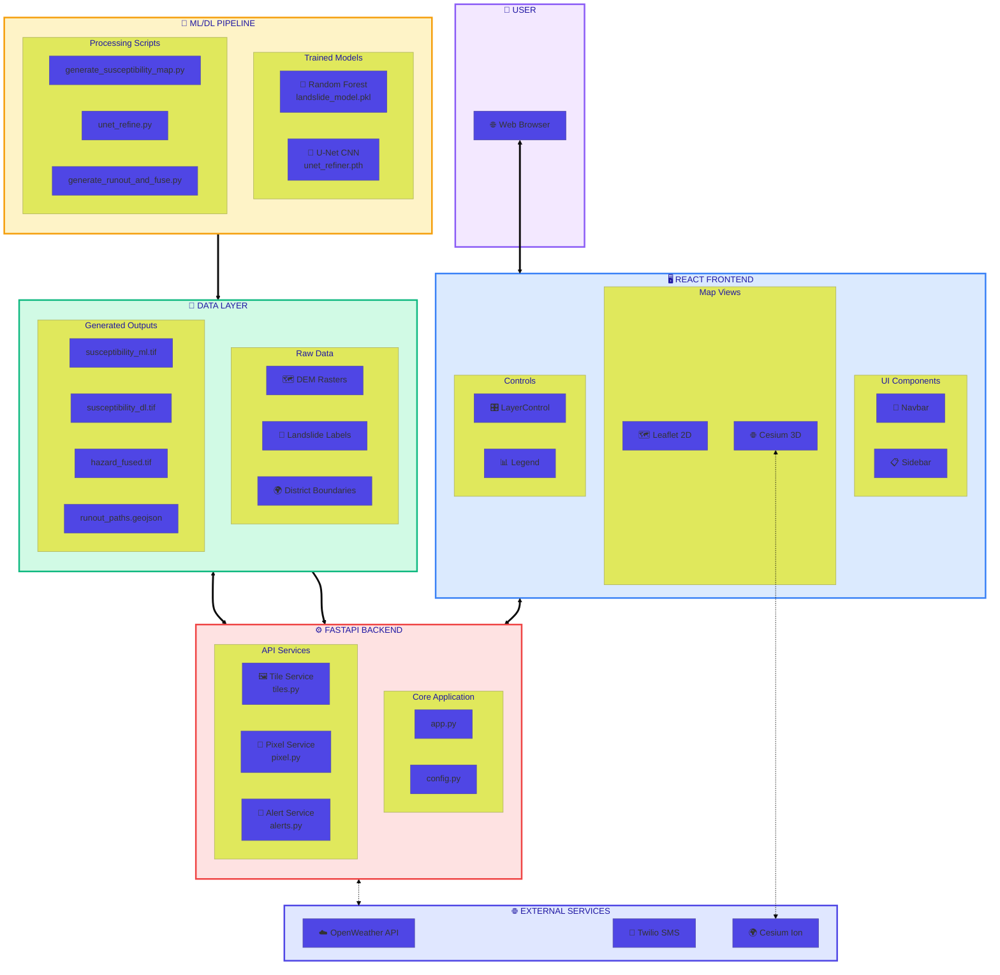
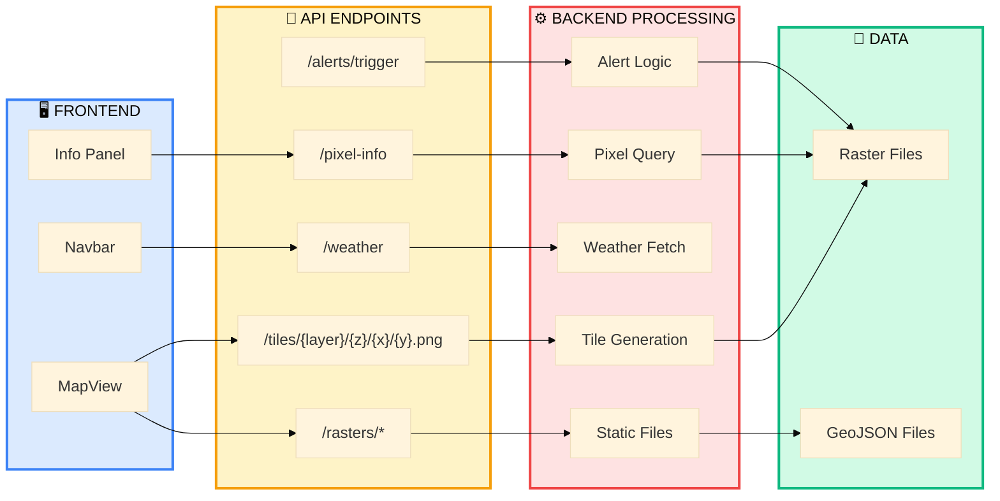
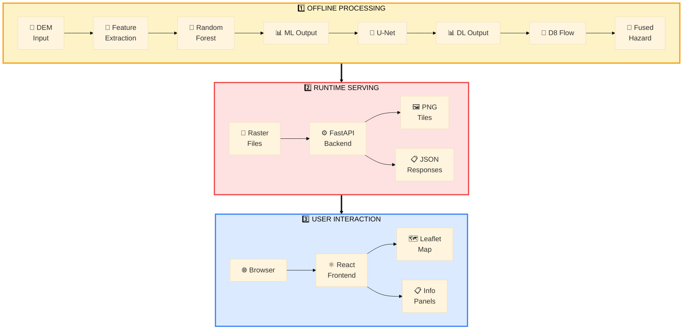
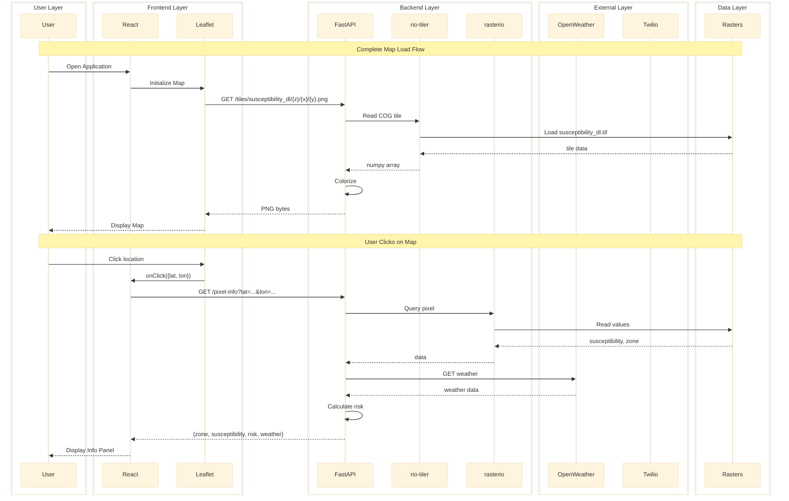
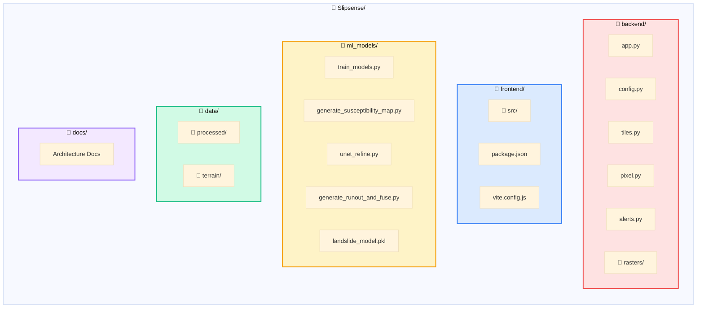
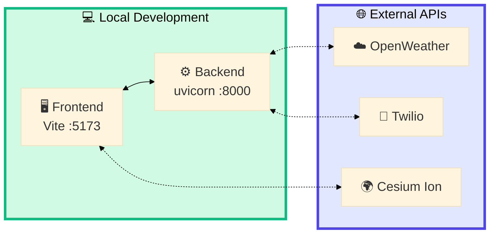

# SlipSense – Full System Integration

> Complete architecture showing Backend + Frontend + ML Model + APIs working together

---

## Complete System Block Diagram

> 📥 **Download**: Open in [Mermaid Live Editor](https://mermaid.live) → Click "Actions" → "Download PNG/SVG"

---

## API Communication Flow

> 📥 **Download**: Open in [Mermaid Live Editor](https://mermaid.live) → Click "Actions" → "Download PNG/SVG"

---

## End-to-End Data Flow

> 📥 **Download**: Open in [Mermaid Live Editor](https://mermaid.live) → Click "Actions" → "Download PNG/SVG"

---

## Complete Request Lifecycle

> 📥 **Download**: Open in [Mermaid Live Editor](https://mermaid.live) → Click "Actions" → "Download PNG/SVG"

---

## Directory Structure

> 📥 **Download**: Open in [Mermaid Live Editor](https://mermaid.live) → Click "Actions" → "Download PNG/SVG"

---

## System Deployment

> 📥 **Download**: Open in [Mermaid Live Editor](https://mermaid.live) → Click "Actions" → "Download PNG/SVG"

---

## Quick Start Commands

| Component | Command | Port |
|-----------|---------|------|
| Backend | `uvicorn app:app --reload` | 8000 |
| Frontend | `npm run dev` | 5173 |
| Both | `run-all.bat` | - |

---

*SlipSense – A terrain-aware approach to landslide hazard assessment for Kerala*
