# SlipSense – Full System Integration

> Complete architecture showing Backend + Frontend + ML Model + APIs working together

---

## Complete System Block Diagram

```mermaid
%%{init: {'theme': 'base', 'themeVariables': { 'fontSize': '16px', 'primaryColor': '#4F46E5'}}}%%
flowchart TB
    subgraph USER["👤 USER"]
        BROWSER["🌐 Web Browser"]
    end

    subgraph FRONTEND["🖥️ REACT FRONTEND"]
        direction TB
        
        subgraph UI_COMPONENTS["UI Components"]
            NAVBAR["🧭 Navbar"]
            SIDEBAR["📋 Sidebar"]
        end
        
        subgraph MAP_VIEWS["Map Views"]
            LEAFLET["🗺️ Leaflet 2D"]
            CESIUM["🌐 Cesium 3D"]
        end
        
        subgraph CONTROLS["Controls"]
            LC["🎛️ LayerControl"]
            LEG["📊 Legend"]
        end
    end

    subgraph BACKEND["⚙️ FASTAPI BACKEND"]
        direction TB
        
        subgraph CORE["Core Application"]
            APP["app.py"]
            CONFIG["config.py"]
        end
        
        subgraph SERVICES["API Services"]
            TILE_SVC["🖼️ Tile Service<br/>tiles.py"]
            PIXEL_SVC["📍 Pixel Service<br/>pixel.py"]
            ALERT_SVC["🚨 Alert Service<br/>alerts.py"]
        end
    end

    subgraph ML_PIPELINE["🤖 ML/DL PIPELINE"]
        direction TB
        
        subgraph MODELS["Trained Models"]
            RF["🌲 Random Forest<br/>landslide_model.pkl"]
            UNET["🧠 U-Net CNN<br/>unet_refiner.pth"]
        end
        
        subgraph PROCESSORS["Processing Scripts"]
            GEN_SUS["generate_susceptibility_map.py"]
            REFINE["unet_refine.py"]
            RUNOUT["generate_runout_and_fuse.py"]
        end
    end

    subgraph DATA_LAYER["📂 DATA LAYER"]
        direction TB
        
        subgraph RAW["Raw Data"]
            DEM["🗺️ DEM Rasters"]
            LABELS["📍 Landslide Labels"]
            BOUNDARY["🌍 District Boundaries"]
        end
        
        subgraph OUTPUT["Generated Outputs"]
            SUS_ML["susceptibility_ml.tif"]
            SUS_DL["susceptibility_dl.tif"]
            HAZ["hazard_fused.tif"]
            PATHS["runout_paths.geojson"]
        end
    end

    subgraph EXTERNAL["🌐 EXTERNAL SERVICES"]
        direction LR
        OPENWEATHER["☁️ OpenWeather API"]
        TWILIO["📱 Twilio SMS"]
        CESIUM_ION["🌍 Cesium Ion"]
    end

    BROWSER <==> FRONTEND
    FRONTEND <==> BACKEND
    BACKEND <==> DATA_LAYER
    ML_PIPELINE ==> DATA_LAYER
    DATA_LAYER ==> BACKEND
    BACKEND <-.-> EXTERNAL
    CESIUM <-.-> CESIUM_ION

    style USER fill:#F3E8FF,stroke:#8B5CF6,stroke-width:3px
    style FRONTEND fill:#DBEAFE,stroke:#3B82F6,stroke-width:3px
    style BACKEND fill:#FEE2E2,stroke:#EF4444,stroke-width:3px
    style ML_PIPELINE fill:#FEF3C7,stroke:#F59E0B,stroke-width:3px
    style DATA_LAYER fill:#D1FAE5,stroke:#10B981,stroke-width:3px
    style EXTERNAL fill:#E0E7FF,stroke:#4F46E5,stroke-width:3px
```

> 📥 **Download**: Open in [Mermaid Live Editor](https://mermaid.live) → Click "Actions" → "Download PNG/SVG"

---

## API Communication Flow

```mermaid
%%{init: {'theme': 'base', 'themeVariables': { 'fontSize': '18px'}}}%%
flowchart LR
    subgraph FRONTEND["🖥️ FRONTEND"]
        MAP["MapView"]
        INFO["Info Panel"]
        NAV["Navbar"]
    end

    subgraph API["📡 API ENDPOINTS"]
        direction TB
        T["/tiles/{layer}/{z}/{x}/{y}.png"]
        P["/pixel-info"]
        W["/weather"]
        A["/alerts/trigger"]
        S["/rasters/*"]
    end

    subgraph BACKEND["⚙️ BACKEND PROCESSING"]
        TILE["Tile Generation"]
        QUERY["Pixel Query"]
        WEATHER["Weather Fetch"]
        ALERT["Alert Logic"]
        STATIC["Static Files"]
    end

    subgraph DATA["📂 DATA"]
        RASTERS["Raster Files"]
        GEOJSON["GeoJSON Files"]
    end

    MAP --> T --> TILE --> RASTERS
    MAP --> S --> STATIC --> GEOJSON
    INFO --> P --> QUERY --> RASTERS
    NAV --> W --> WEATHER
    A --> ALERT --> RASTERS

    style FRONTEND fill:#DBEAFE,stroke:#3B82F6,stroke-width:3px
    style API fill:#FEF3C7,stroke:#F59E0B,stroke-width:3px
    style BACKEND fill:#FEE2E2,stroke:#EF4444,stroke-width:3px
    style DATA fill:#D1FAE5,stroke:#10B981,stroke-width:3px
```

> 📥 **Download**: Open in [Mermaid Live Editor](https://mermaid.live) → Click "Actions" → "Download PNG/SVG"

---

## End-to-End Data Flow

```mermaid
%%{init: {'theme': 'base', 'themeVariables': { 'fontSize': '18px'}}}%%
flowchart TB
    subgraph PHASE1["1️⃣ OFFLINE PROCESSING"]
        direction LR
        DEM["📂 DEM<br/>Input"] --> FEAT["🔬 Feature<br/>Extraction"]
        FEAT --> RF["🌲 Random<br/>Forest"]
        RF --> ML["📊 ML Output"]
        ML --> UNET["🧠 U-Net"]
        UNET --> DL["📊 DL Output"]
        DL --> D8["📐 D8 Flow"]
        D8 --> FUSED["🎯 Fused<br/>Hazard"]
    end

    subgraph PHASE2["2️⃣ RUNTIME SERVING"]
        direction LR
        RASTERS["📂 Raster<br/>Files"] --> API["⚙️ FastAPI<br/>Backend"]
        API --> TILES["🖼️ PNG<br/>Tiles"]
        API --> JSON["📋 JSON<br/>Responses"]
    end

    subgraph PHASE3["3️⃣ USER INTERACTION"]
        direction LR
        BROWSER["🌐 Browser"] --> REACT["⚛️ React<br/>Frontend"]
        REACT --> LEAFLET["🗺️ Leaflet<br/>Map"]
        REACT --> INFO["📋 Info<br/>Panels"]
    end

    PHASE1 ==> PHASE2 ==> PHASE3

    style PHASE1 fill:#FEF3C7,stroke:#F59E0B,stroke-width:3px
    style PHASE2 fill:#FEE2E2,stroke:#EF4444,stroke-width:3px
    style PHASE3 fill:#DBEAFE,stroke:#3B82F6,stroke-width:3px
```

> 📥 **Download**: Open in [Mermaid Live Editor](https://mermaid.live) → Click "Actions" → "Download PNG/SVG"

---

## Complete Request Lifecycle

> 📥 **Download**: Open in [Mermaid Live Editor](https://mermaid.live) → Click "Actions" → "Download PNG/SVG"

---

## Directory Structure

```mermaid
%%{init: {'theme': 'base', 'themeVariables': { 'fontSize': '14px'}}}%%
flowchart TB
    subgraph ROOT["📁 Slipsense/"]
        direction TB
        
        subgraph BACK["📁 backend/"]
            APP_PY["app.py"]
            CONFIG_PY["config.py"]
            TILES_PY["tiles.py"]
            PIXEL_PY["pixel.py"]
            ALERTS_PY["alerts.py"]
            RASTERS_DIR["📁 rasters/"]
        end
        
        subgraph FRONT["📁 frontend/"]
            SRC["📁 src/"]
            PKG["package.json"]
            VITE_CFG["vite.config.js"]
        end
        
        subgraph ML["📁 ml_models/"]
            TRAIN["train_models.py"]
            GEN_SUS["generate_susceptibility_map.py"]
            UNET_REF["unet_refine.py"]
            GEN_RUN["generate_runout_and_fuse.py"]
            MODEL_PKL["landslide_model.pkl"]
        end
        
        subgraph DATA["📁 data/"]
            FEATURES["📁 processed/"]
            DEM_DIR["📁 terrain/"]
        end
        
        subgraph DOCS["📁 docs/"]
            ARCH["Architecture Docs"]
        end
    end

    style BACK fill:#FEE2E2,stroke:#EF4444,stroke-width:2px
    style FRONT fill:#DBEAFE,stroke:#3B82F6,stroke-width:2px
    style ML fill:#FEF3C7,stroke:#F59E0B,stroke-width:2px
    style DATA fill:#D1FAE5,stroke:#10B981,stroke-width:2px
    style DOCS fill:#F3E8FF,stroke:#8B5CF6,stroke-width:2px
```

> 📥 **Download**: Open in [Mermaid Live Editor](https://mermaid.live) → Click "Actions" → "Download PNG/SVG"

---

## System Deployment

```mermaid
%%{init: {'theme': 'base', 'themeVariables': { 'fontSize': '20px'}}}%%
flowchart LR
    subgraph LOCAL["💻 Local Development"]
        direction TB
        BACK["⚙️ Backend<br/>uvicorn :8000"]
        FRONT["🖥️ Frontend<br/>Vite :5173"]
    end

    subgraph EXTERNAL["🌐 External APIs"]
        OW["☁️ OpenWeather"]
        TW["📱 Twilio"]
        CI["🌍 Cesium Ion"]
    end

    FRONT <--> BACK
    BACK <-.-> OW
    BACK <-.-> TW
    FRONT <-.-> CI

    style LOCAL fill:#D1FAE5,stroke:#10B981,stroke-width:4px
    style EXTERNAL fill:#E0E7FF,stroke:#4F46E5,stroke-width:4px
```

> 📥 **Download**: Open in [Mermaid Live Editor](https://mermaid.live) → Click "Actions" → "Download PNG/SVG"

---

## Quick Start Commands

| Component | Command | Port |
|-----------|---------|------|
| Backend | `uvicorn app:app --reload` | 8000 |
| Frontend | `npm run dev` | 5173 |
| Both | `run-all.bat` | - |

---

*SlipSense – A terrain-aware approach to landslide hazard assessment for Kerala*
