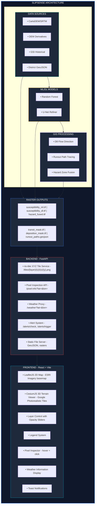

# SlipSense Architecture

```mermaid
flowchart TB
    subgraph ARCH["SLIPSENSE ARCHITECTURE"]
        direction TB
        
        subgraph TOP[" "]
            direction LR
            
            subgraph DATA["DATA SOURCES"]
                D1["• CartoDEM/SRTM"]
                D2["• DEM Derivatives"]
                D3["• GSI Historical"]
                D4["• District GeoJSON"]
            end
            
            subgraph MODELS["ML/DL MODELS"]
                M1["• Random Forest"]
                M2["• U-Net Refiner"]
            end
            
            subgraph GIS["GIS PROCESSING"]
                G1["• D8 Flow Direction"]
                G2["• Runout Path Tracing"]
                G3["• Hazard Zone Fusion"]
            end
            
            DATA --> MODELS --> GIS
        end
        
        subgraph OUTPUTS["RASTER OUTPUTS"]
            O1["susceptibility_ml.tif | susceptibility_dl.tif | hazard_fused.tif"]
            O2["transit_mask.tif | deposition_mask.tif | runout_paths.geojson"]
        end
        
        subgraph BACKEND["BACKEND - FastAPI"]
            B1["• rio-tiler XYZ Tile Service - /tiles/{layer}/{z}/{x}/{y}.png"]
            B2["• Pixel Inspection API - /pixel-info?lat=&lon="]
            B3["• Weather Proxy - /weather?lat=&lon="]
            B4["• Alert System - /alerts/check, /alerts/trigger"]
            B5["• Static File Server - GeoJSON, rasters"]
        end
        
        subgraph FRONTEND["FRONTEND - React + Vite"]
            F1["• LeafletJS 2D Map - ESRI Imagery basemap"]
            F2["• CesiumJS 3D Terrain Viewer - Google Photorealistic Tiles"]
            F3["• Layer Control with Opacity Sliders"]
            F4["• Legend System"]
            F5["• Pixel Inspector - hover + click"]
            F6["• Weather Information Display"]
            F7["• Toast Notifications"]
        end
        
        DATA --> OUTPUTS
        MODELS --> OUTPUTS
        GIS --> OUTPUTS
        OUTPUTS --> BACKEND --> FRONTEND
    end
    
    style ARCH fill:#0f172a,stroke:#3b82f6,stroke-width:2px,color:#fff
    style DATA fill:#1e293b,stroke:#10b981,color:#fff
    style MODELS fill:#1e293b,stroke:#f59e0b,color:#fff
    style GIS fill:#1e293b,stroke:#8b5cf6,color:#fff
    style OUTPUTS fill:#1e293b,stroke:#3b82f6,color:#fff
    style BACKEND fill:#1e293b,stroke:#ef4444,color:#fff
    style FRONTEND fill:#1e293b,stroke:#06b6d4,color:#fff
```
