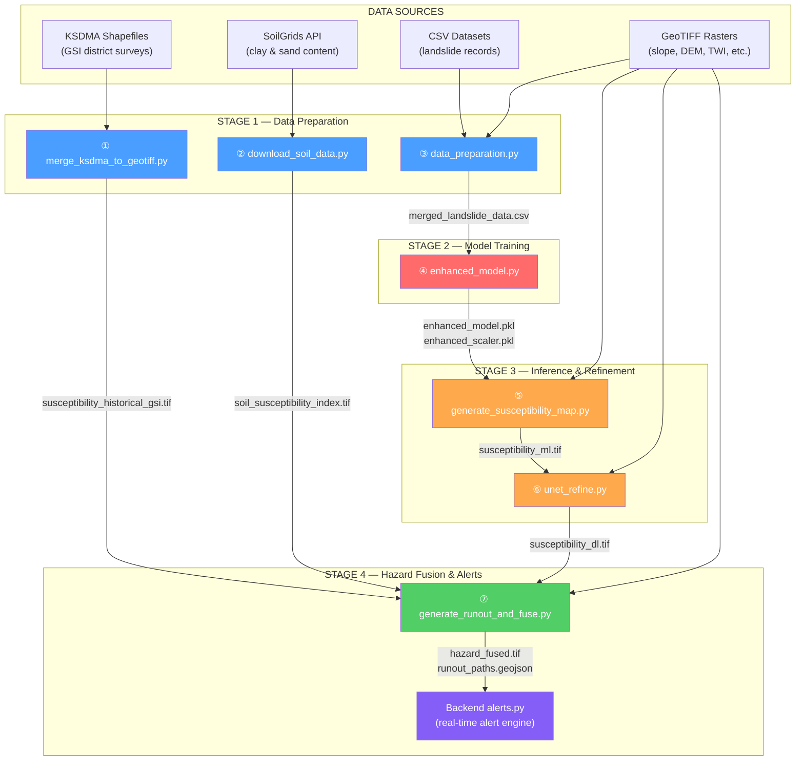

# SlipSense ML Pipeline — Full Walkthrough

> **Purpose**: Presentation-ready explanation of how the machine learning works, from raw data to final hazard map and SMS alerts. Each program is listed in execution order, with its **inputs**, **what it does**, and **outputs**.

---

## Pipeline Overview Diagram



---

## Program-by-Program Breakdown

---

### ① `merge_ksdma_to_geotiff.py` — Historical Susceptibility Rasterization

> **Location**: [merge_ksdma_to_geotiff.py](file:///c:/coding/Slipsense/tools/merge_ksdma_to_geotiff.py)

#### What it does
Converts **vector shapefiles** from the Kerala State Disaster Management Authority (KSDMA/GSI 2022 survey) into a **single raster GeoTIFF**. These shapefiles contain expert-classified landslide susceptibility zones (Low / Moderate / High) for each Kerala district.

#### Inputs

| Input | Format | Description |
|-------|--------|-------------|
| `data/ksdma_landslide_data/*/…_GSI_LS.shp` | Shapefile (.shp) | Per-district vector polygons with susceptibility classification |

#### Processing Steps
1. **Find** all `*_GSI_LS.shp` shapefiles across 13 district folders
2. **Load & merge** all shapefiles into a single GeoDataFrame
3. **Reproject** to WGS84 (EPSG:4326) if needed
4. **Map string labels** to numeric codes: `Very Low → 1`, `Low → 2`, `Moderate → 3`, `High → 4`, `Very High → 5`
5. **Rasterize** the merged polygons at ~30m resolution onto a regular grid

#### Output

| Output | Format | Description |
|--------|--------|-------------|
| `backend/rasters/susceptibility_historical_gsi.tif` | GeoTIFF (uint8) | Historical susceptibility raster (values 0–5) |

> [!NOTE]
> This raster is used later in Program ⑦ as a **calibration reference** to blend with the ML prediction — grounding the model's output in expert geological knowledge.

---

### ② `download_soil_data.py` — Soil Property Acquisition

> **Location**: [download_soil_data.py](file:///c:/coding/Slipsense/ml_models/download_soil_data.py)

#### What it does
Downloads **real soil composition data** (clay % and sand %) from the ISRIC SoilGrids v2.0 REST API and computes a **Soil Susceptibility Index (SSI)** — a 0–1 score indicating how prone the soil is to becoming unstable when saturated.

#### Inputs

| Input | Source | Description |
|-------|--------|-------------|
| SoilGrids REST API | `rest.isric.org` | Global 250m-resolution soil data (CC-BY 4.0 license) |
| `backend/rasters/susceptibility_dl.tif` | Local raster | Reference raster for CRS alignment and dimensions |

#### Processing Steps
1. **Create a sample grid** (~784 points at 0.05° intervals) covering the study area (lon 74.8–76.2, lat 11.8–13.2)
2. **Query the SoilGrids API** for **clay content** (0–5cm depth mean) at each point
3. **Query again** for **sand content** (0–5cm depth mean)
4. **Fill NaN gaps** using nearest-neighbor interpolation
5. **Compute the Soil Susceptibility Index**:
   ```
   SSI = (clay_normalized × 0.6) + ((1 − sand_normalized) × 0.4)
   ```
   - High clay → holds water, becomes heavy and plastic → **more prone** to sliding
   - Low sand → poor drainage → **more prone** to saturation
6. **Reproject** the result from WGS84 to the projected CRS of the reference raster (EPSG:32643)

#### Outputs

| Output | Format | Description |
|--------|--------|-------------|
| `backend/rasters/soil_clay_content.tif` | GeoTIFF (float32) | Raw clay content (%) |
| `backend/rasters/soil_sand_content.tif` | GeoTIFF (float32) | Raw sand content (%) |
| `backend/rasters/soil_susceptibility_index.tif` | GeoTIFF (float32) | Combined SSI (0–1 scale) |

> [!NOTE]
> The SSI is used in Program ⑦ for blending into the final hazard map, and in the alert system to lower rainfall thresholds for clay-rich areas.

---

### ③ `data_preparation.py` — Training Dataset Assembly

> **Location**: [data_preparation.py](file:///c:/coding/Slipsense/ml_models/data_preparation.py)

#### What it does
Merges **three separate data sources** into a single, balanced CSV file of ~750+ labeled samples for training the ML model.

#### Inputs

| Input | Format | Samples | Description |
|-------|--------|---------|-------------|
| `data/landslide - Sheet1 (1).csv` | CSV | ~250 | Primary training data with pre-extracted terrain features |
| `data/kerala_landslide_data.csv` | CSV | ~501 | Kerala district data with slope and rainfall info |
| `data/Global_Landslide_Catalog_Export_rows.csv` | CSV | ~11,000 total | NASA Global Catalog — filtered to India events (~100+) |
| `backend/rasters/*.tif` | GeoTIFF | — | 9 terrain rasters for feature extraction from coordinates |

#### The 9 Terrain Features (columns in the final CSV)

| Feature | Raster Source | What It Measures |
|---------|---------------|------------------|
| `slope` | slope75.tif | Steepness of terrain (degrees) |
| `aspect` | aspect75.tif | Compass direction the slope faces |
| `elevation` | DEM_filled_75.tif | Height above sea level (meters) |
| `twi` | TWI_FINAL.tif | Topographic Wetness Index — tendency to accumulate water |
| `spi` | SPI75.tif | Stream Power Index — erosive power of water flow |
| `flow_acc` | Flow_Accumulation_clean75.tif | Upstream drainage area flowing to a point |
| `dist_river` | Distance_to_River_75.tif | Distance from nearest river/stream |
| `drainage_density` | Drainage_Density_Final.tif | Concentration of drainage channels |
| `relative_relief` | Relative_Relief_75.tif | Elevation difference within a neighborhood |

#### Processing Steps
1. **Load primary data** — rename columns to standardized names, extract 9 features + landslide label
2. **Load Kerala data** — map risk levels (`High/Moderate → 1`, `Low → 0`), approximate missing terrain features
3. **Load Global Catalog** — filter to India (Kerala/Karnataka bounds: lat 8–16, lon 74–78.5), extract features from rasters using lat/lon coordinates; if rasters don't cover the point, generate synthetic samples based on landslide-prone terrain characteristics
4. **Generate negative samples** — create ~100 synthetic "safe" terrain profiles (low slope, low elevation, far from rivers)
5. **Balance** the dataset to ~45/55 positive/negative split
6. **Fill NaN** values with column medians

#### Output

| Output | Format | Description |
|--------|--------|-------------|
| `data/merged_landslide_data.csv` | CSV | ~750+ rows, 9 feature columns + `landslide` label (0/1) + `source` |

> [!IMPORTANT]
> This CSV is the **single training file** consumed by the next program. The label column is binary: `landslide = 1` (landslide occurred) or `landslide = 0` (safe location).

---

### ④ `enhanced_model.py` — Stacking Ensemble Training

> **Location**: [enhanced_model.py](file:///c:/coding/Slipsense/ml_models/enhanced_model.py)

#### What it does
Trains a **Stacking Ensemble** classifier — three diverse tree-based models whose predictions are combined by a logistic regression meta-learner. Target: **F1 ≥ 0.70**.

#### Input

| Input | Format | Description |
|-------|--------|-------------|
| `data/merged_landslide_data.csv` | CSV | Output of Program ③ — 750+ labeled samples |

#### Model Architecture

```
Stacking Ensemble
├── Level 1 — Base Models (each trained independently)
│   ├── RandomForest       (300 trees, max_depth=12)
│   ├── XGBoost            (300 trees, max_depth=8, lr=0.05)
│   └── LightGBM           (300 trees, max_depth=8, lr=0.05)
│
└── Level 2 — Meta-Learner
    └── LogisticRegression  (balanced class weights)
```

#### Processing Steps
1. **Load** the merged CSV → extract 9 feature columns as `X`, `landslide` column as `y`
2. **Split** into 80% train / 20% test (stratified by class)
3. **Scale** features using `StandardScaler` (zero mean, unit variance)
4. **SMOTE** oversampling — synthetically generates new minority-class samples to improve balance
5. **Train** the stacking ensemble:
   - Each base model makes predictions via 5-fold cross-validation
   - Those predictions become **input features** for the meta-learner
   - The meta-learner learns the optimal way to combine the three models
6. **Evaluate** on the held-out test set — compute accuracy, F1, precision, recall, ROC-AUC

#### Outputs

| Output | Format | Description |
|--------|--------|-------------|
| `ml_models/enhanced_model.pkl` | Pickle (joblib) | Serialized stacking ensemble (~4 MB) |
| `ml_models/enhanced_scaler.pkl` | Pickle (joblib) | Fitted StandardScaler (for matching training normalization) |
| `ml_models/enhanced_model_report.md` | Markdown | Performance metrics table and confusion matrix |

> [!TIP]
> The **scaler is just as important as the model** — inference must apply the exact same scaling transform that was used during training, otherwise predictions will be garbage.

---

### ⑤ `generate_susceptibility_map.py` — ML Inference on Rasters

> **Location**: [generate_susceptibility_map.py](file:///c:/coding/Slipsense/ml_models/generate_susceptibility_map.py)

#### What it does
Applies the trained model to **every pixel** in the study area to produce a continuous **landslide susceptibility probability map** (0.0 = safe, 1.0 = certain landslide).

#### Inputs

| Input | Format | Description |
|-------|--------|-------------|
| `ml_models/enhanced_model.pkl` | Pickle | Trained stacking ensemble from Program ④ |
| `ml_models/enhanced_scaler.pkl` | Pickle | Fitted scaler from Program ④ |
| 9 terrain rasters in `backend/rasters/` | GeoTIFF | Same 9 rasters used in training (see table in Program ③) |

#### Processing Steps
1. **Load** the model and scaler from `.pkl` files
2. **Read** all 9 raster GeoTIFFs; resize any that have different dimensions to match the reference shape
3. **Stack** into a 3D array of shape `(Height, Width, 9)`
4. **Flatten** to shape `(H×W, 9)` — each pixel becomes one "sample" row
5. **Scale** using the saved scaler (`scaler.transform()`)
6. **Predict** using `model.predict_proba()` → extract column 1 (probability of landslide)
7. **Reshape** back to `(Height, Width)` — a 2D probability map
8. **Save** as a GeoTIFF with LZW compression

#### Output

| Output | Format | Description |
|--------|--------|-------------|
| `backend/rasters/susceptibility_ml.tif` | GeoTIFF (float32) | Per-pixel landslide probability (0.0–1.0) |

```
Input (9 rasters):                    Output:
┌──────────┐                          ┌──────────────────────┐
│ slope    │                          │ susceptibility_ml.tif│
│ aspect   │  ┌─────────────┐         │                      │
│ elevation│  │  Scale +     │         │  0.12  0.34  0.87 …  │
│ twi      │→ │  Model       │→       │  0.05  0.91  0.76 …  │
│ spi      │  │  Predict     │         │  0.23  0.45  0.62 …  │
│ flow_acc │  └─────────────┘         │  …                   │
│ dist_river│                         └──────────────────────┘
│ drainage │
│ rel_relief│
└──────────┘
```

---

### ⑥ `unet_refine.py` — Deep Learning Spatial Refinement

> **Location**: [unet_refine.py](file:///c:/coding/Slipsense/ml_models/unet_refine.py)

#### What it does
Trains a **lightweight U-Net** (convolutional neural network) to **spatially refine** the ML susceptibility map. The ML model predicts each pixel independently — it has no concept of neighborhood context. The U-Net learns spatial patterns (edges, gradients, contiguous zones) from the terrain to produce a smoother, more geographically coherent output.

#### Inputs

| Input | Format | Description |
|-------|--------|-------------|
| `backend/rasters/susceptibility_ml.tif` | GeoTIFF | ML susceptibility map from Program ⑤ |
| `backend/rasters/slope75.tif` | GeoTIFF | Slope raster |
| `backend/rasters/DEM_filled_75.tif` | GeoTIFF | Digital Elevation Model |

#### U-Net Architecture

```
Input: 3 channels (susceptibility + slope + DEM), 256×256 patches

Encoder:
  Conv(3→32) → Pool → Conv(32→64) → Pool → Conv(64→128)

Decoder (with skip connections from encoder):
  Up → Cat(128+64) → Conv → Up → Cat(64+32) → Conv → Conv(32→1)

Output: 1 channel (refined susceptibility), 256×256 patches
```

#### Processing Steps
1. **Extract patches** — slide a 256×256 window with stride 128 across all three rasters
2. **Normalize** each patch independently to 0–1 range (min-max per patch)
3. **Stack** as 3-channel input: `[susceptibility, slope, DEM]`
4. **Train** for 5 epochs with:
   - **L1 loss** (smooth results) + **edge-aware loss** (preserve terrain boundaries via Sobel gradients)
   - Data augmentation: horizontal/vertical flips, 90° rotations
   - Early stopping (patience = 3)
5. **Inference** — slide the window across the full raster, predict, and average overlapping patches
6. **Clip** output to [0, 1] and save as GeoTIFF

#### Outputs

| Output | Format | Description |
|--------|--------|-------------|
| `backend/rasters/susceptibility_dl.tif` | GeoTIFF (float32) | Spatially refined susceptibility map (0.0–1.0) |
| `backend/rasters/unet_refiner.pth` | PyTorch state dict | Saved U-Net model weights |

> [!IMPORTANT]
> **`susceptibility_dl.tif` is the key output** — this is the refined map used by both the hazard fusion (Program ⑦) and the real-time alert system.

---

### ⑦ `generate_runout_and_fuse.py` — Runout Simulation & Final Hazard Fusion

> **Location**: [generate_runout_and_fuse.py](file:///c:/coding/Slipsense/ml_models/generate_runout_and_fuse.py)

#### What it does
This is the most complex program. It takes the refined susceptibility map and **simulates what happens after a landslide triggers**: where does the debris travel (runout paths), where does it stop (deposition zones), and what areas are in the transit corridor. It then fuses everything into a **final hazard classification map** with 4 zone codes.

#### Inputs

| Input | Format | Description |
|-------|--------|-------------|
| `backend/rasters/susceptibility_dl.tif` | GeoTIFF | DL-refined susceptibility from Program ⑥ |
| `backend/rasters/DEM_filled_75.tif` | GeoTIFF | Digital Elevation Model |
| `backend/rasters/slope75.tif` | GeoTIFF | Slope raster |
| `backend/rasters/Flow_Accumulation_clean75.tif` | GeoTIFF | Flow accumulation raster |
| `backend/rasters/susceptibility_historical_gsi.tif` | GeoTIFF | Historical GSI data from Program ① |
| `backend/rasters/soil_susceptibility_index.tif` | GeoTIFF | Soil index from Program ② |

#### Processing Steps

**Step A — Blend susceptibility with historical + soil data:**
```
Blended susceptibility at each pixel:
  Both hist+soil available → DL × 0.55  +  GSI × 0.30  +  Soil × 0.15
  Hist only              → DL × 0.70  +  GSI × 0.30
  Soil only              → DL × 0.85  +  Soil × 0.15
  Neither                → DL × 1.00
```

**Step B — Compute D8 flow direction:**
- For every pixel, find the steepest downhill neighbor (8 possible directions)
- Produces a flow-direction grid (bitmask: 1=E, 2=SE, 4=S, 8=SW, 16=W, 32=NW, 64=N, 128=NE)

**Step C — Identify failure source zones:**
- All pixels with **blended susceptibility ≥ 0.80** are candidate failure sources
- Morphological opening removes noise; connected components smaller than 15 pixels are discarded
- Each remaining cluster's centroid becomes a runout **source point**

**Step D — Trace runout paths:**
- From each source point, follow the D8 flow-direction pointers downhill
- Stop when reaching a **stream** (flow accumulation ≥ 8000) or the raster edge
- Record the path as a line geometry

**Step E — Create transit and deposition masks:**
- **Transit mask**: buffer the runout paths by 5 pixels (~150m) in all directions
- **Deposition mask**: dilate the last 5 pixels of each path into a circular fan (radius 6 pixels), then filter to only keep areas where **slope ≤ 20°** (flat ground where debris stops)

**Step F — Fuse into final hazard raster:**
```
Code 0 = Safe        — no hazard
Code 1 = Deposition  — debris accumulation zone (flat, at end of runout)
Code 2 = Transit     — debris travel corridor (steep, along runout path)
Code 3 = Failure     — landslide initiation zone (blended susceptibility ≥ 0.80)
```
Paint order: Deposition first → Transit → Failure (highest severity overrides)

#### Outputs

| Output | Format | Description |
|--------|--------|-------------|
| `backend/rasters/hazard_fused.tif` | GeoTIFF (uint8) | Final hazard map (codes 0–3) |
| `backend/rasters/runout_paths.geojson` | GeoJSON (WGS84) | Runout path lines for map overlay |
| `backend/rasters/transit_mask.tif` | GeoTIFF (uint8) | Binary transit corridor mask |
| `backend/rasters/deposition_mask.tif` | GeoTIFF (uint8) | Binary deposition zone mask |

---

## Final Consumer: `alerts.py` — Real-Time Alert Engine

> **Location**: [alerts.py](file:///c:/coding/Slipsense/backend/alerts.py)

This is **not an ML program** — it's the FastAPI backend that reads the ML outputs at runtime to make alert decisions.

#### Inputs from the ML Pipeline

| Input | Produced By | Purpose |
|-------|-------------|---------|
| `susceptibility_dl.tif` | Program ⑥ | Read per-district average/max susceptibility |
| `hazard_fused.tif` | Program ⑦ | Check if district contains Failure or Transit zones |
| `soil_susceptibility_index.tif` | Program ② | Soil risk lowers the rainfall threshold |
| OpenWeather API | Live | Real-time rainfall data |

#### Alert Trigger Conditions (ALL must be true)

| Condition | Threshold |
|-----------|-----------|
| Susceptibility (avg OR max) | ≥ 0.75 |
| Rainfall in last 24 hours | ≥ 50mm (or ≥ 30mm if soil is clay-rich) |
| Hazard zones present | Failure (3) or Transit (2) detected |

When triggered → SMS sent via Vonage/Twilio/Fast2SMS.

---

## Complete Data Flow Summary

```
CSV datasets ─────┐
                   ├──→ ③ data_preparation.py ──→ merged_landslide_data.csv
Terrain rasters ───┘                                        │
                                                            ▼
                                              ④ enhanced_model.py
                                              ├── enhanced_model.pkl
                                              └── enhanced_scaler.pkl
                                                            │
Terrain rasters (×9) ──────────────────────────────────────→│
                                                            ▼
                                        ⑤ generate_susceptibility_map.py
                                              └── susceptibility_ml.tif
                                                            │
Slope + DEM rasters ───────────────────────────────────────→│
                                                            ▼
                                              ⑥ unet_refine.py
                                              └── susceptibility_dl.tif ─────────┐
                                                                                  │
KSDMA Shapefiles → ① merge_ksdma ──→ susceptibility_historical_gsi.tif ─────────┤
SoilGrids API    → ② download_soil → soil_susceptibility_index.tif ─────────────┤
DEM + Slope + Flow Accumulation ────────────────────────────────────────────────→│
                                                                                  ▼
                                                          ⑦ generate_runout_and_fuse.py
                                                          ├── hazard_fused.tif
                                                          ├── runout_paths.geojson
                                                          ├── transit_mask.tif
                                                          └── deposition_mask.tif
                                                                    │
                                                                    ▼
                                                       alerts.py (runtime)
                                                     + OpenWeather rainfall
                                                              │
                                                              ▼
                                                        SMS ALERT 📱
```

---

## Execution Order Summary

| Order | Script | Key Input | Key Output | Time |
|-------|--------|-----------|------------|------|
| **1** | `merge_ksdma_to_geotiff.py` | KSDMA shapefiles | `susceptibility_historical_gsi.tif` | ~1 min |
| **2** | `download_soil_data.py` | SoilGrids API | `soil_susceptibility_index.tif` | ~30 min |
| **3** | `data_preparation.py` | 3 CSVs + 9 rasters | `merged_landslide_data.csv` | ~2 min |
| **4** | `enhanced_model.py` | `merged_landslide_data.csv` | `enhanced_model.pkl` + `enhanced_scaler.pkl` | ~5 min |
| **5** | `generate_susceptibility_map.py` | `.pkl` files + 9 rasters | `susceptibility_ml.tif` | ~3 min |
| **6** | `unet_refine.py` | `susceptibility_ml.tif` + slope + DEM | `susceptibility_dl.tif` | ~15 min |
| **7** | `generate_runout_and_fuse.py` | `susceptibility_dl.tif` + 5 rasters | `hazard_fused.tif` + `runout_paths.geojson` | ~10 min |

> [!TIP]
> Programs ① and ② are **independent** of each other and of ③–④. They can be run in any order or in parallel. The strict ordering is: **③ → ④ → ⑤ → ⑥ → ⑦**.

---

# Data Sources — Where Every Dataset Comes From

Every dataset used in the SlipSense pipeline, with source, URL, license, resolution, and how it enters the pipeline.

---

## Terrain Rasters (9 Features)

| Raster | Source | Resolution | How Obtained | Used In |
|--------|--------|------------|-------------|---------|
| **DEM_filled_75.tif** | CartoDEM v3 / SRTM (NASA/USGS) | 30m (resampled to 75m) | Downloaded from [USGS EarthExplorer](https://earthexplorer.usgs.gov/) or [Bhuvan (ISRO)](https://bhuvan.nrsc.gov.in/); sinks filled using GRASS GIS `r.fill.dir` | Programs ③⑤⑥⑦ |
| **slope75.tif** | Derived from DEM | 75m | Computed using GDAL `gdaldem slope` or QGIS Raster Terrain Analysis | Programs ③⑤⑥⑦ |
| **aspect75.tif** | Derived from DEM | 75m | Computed using GDAL `gdaldem aspect` | Programs ③⑤ |
| **TWI_FINAL.tif** | Derived from DEM | 75m | `TWI = ln(contributing_area / tan(slope))` — computed via SAGA GIS or WhiteboxTools | Programs ③⑤ |
| **SPI75.tif** | Derived from DEM | 75m | `SPI = contributing_area × tan(slope)` — computed via SAGA GIS | Programs ③⑤ |
| **Flow_Accumulation_clean75.tif** | Derived from DEM | 75m | D8 flow accumulation computed via WhiteboxTools or GRASS GIS `r.watershed` | Programs ③⑤⑦ |
| **Distance_to_River_75.tif** | Derived from Flow Accumulation | 75m | Euclidean distance from each pixel to nearest stream channel (flow_acc ≥ threshold) | Programs ③⑤ |
| **Drainage_Density_Final.tif** | Derived from stream network | 75m | Stream length per unit area computed via kernel density on extracted drainage | Programs ③⑤ |
| **Relative_Relief_75.tif** | Derived from DEM | 75m | Max elevation − Min elevation within a moving window (focal statistics) | Programs ③⑤ |

> **Original DEM source**: NASA's Shuttle Radar Topography Mission (SRTM) at 30m or ISRO's CartoDEM v3 at 30m. Both are freely available satellite-derived DEMs. All 8 derivative rasters are computed from this single DEM using standard GIS processing.

---

## Landslide Training Data (3 CSVs)

| Dataset | Source | Records | License | URL / Access |
|---------|--------|---------|---------|-------------|
| **landslide - Sheet1 (1).csv** | Primary field survey + published studies | ~250 labeled points | Academic use | Manually compiled from Kerala landslide literature and field GPS recordings |
| **kerala_landslide_data.csv** | Kerala State Disaster Management Authority (KSDMA) | ~501 district-level records | Government open data | [KSDMA Portal](https://sdma.kerala.gov.in/) — district-wise landslide event logs with risk classification |
| **Global_Landslide_Catalog_Export_rows.csv** | NASA Global Landslide Catalog (GLC) | ~11,000 global (filtered to ~100 India events) | Public domain (NASA) | [NASA GLC on data.nasa.gov](https://data.nasa.gov/Earth-Science/Global-Landslide-Catalog-Export/dd9e-wu2v) |

---

## Historical Susceptibility (GSI/KSDMA)

| Dataset | Source | Coverage | Format | License |
|---------|--------|----------|--------|---------|
| **KSDMA district shapefiles** (`*_GSI_LS.shp`) | Geological Survey of India (GSI) via KSDMA 2022 Survey | 13 of 14 Kerala districts | Shapefile (.shp) with susceptibility classification (Very Low → Very High) | Government of India — released for public hazard awareness |

> **Access**: These were obtained from KSDMA's district-level landslide susceptibility mapping program conducted by GSI in 2022. Contact: [Kerala SDMA](https://sdma.kerala.gov.in/)
>
> **Used in**: Program ① converts these to `susceptibility_historical_gsi.tif`, which is blended in Program ⑦

---

## Soil Data

| Dataset | Source | Resolution | Format | License | URL |
|---------|--------|------------|--------|---------|-----|
| **Clay content (0–5cm)** | ISRIC SoilGrids v2.0 | 250m global | REST API (GeoTIFF tiles) | CC-BY 4.0 | [rest.isric.org](https://rest.isric.org) |
| **Sand content (0–5cm)** | ISRIC SoilGrids v2.0 | 250m global | REST API (GeoTIFF tiles) | CC-BY 4.0 | [rest.isric.org](https://rest.isric.org) |

> **Access**: Free REST API — no authentication required. Queried at ~784 grid points covering the study area. Data is interpolated from global soil profile databases.
>
> **Used in**: Program ② queries the API and computes the Soil Susceptibility Index (SSI)

---

## Real-Time Weather Data

| Dataset | Source | Update Frequency | Format | License | URL |
|---------|--------|-----------------|--------|---------|-----|
| **Current weather + rainfall** | OpenWeather API (v2.5) | Every 10 minutes | JSON | Free tier: 1,000 calls/day | [openweathermap.org/api](https://openweathermap.org/api) |

> **Used in**: `alerts.py` — fetches rainfall (mm) at each district's centroid to evaluate alert conditions. Requires an API key stored in `.env` as `OPENWEATHER_API_KEY`.

---

## Administrative Boundaries

| Dataset | Source | Format | License |
|---------|--------|--------|---------|
| **Kerala_District_Boundary.geojson** | Government of Kerala / Survey of India | GeoJSON (WGS84) | Government open data |
| **District polygons for raster clipping** | Same source, simplified for raster operations | GeoJSON | Government open data |

> **Used in**: `alerts.py` for district-level sampling, `generate_district_rasters.py` for per-district raster clipping, and frontend for boundary overlays.

---

## 3D Visualization & Basemaps

| Service | Provider | Used For | License |
|---------|----------|----------|---------|
| **Google Photorealistic 3D Tiles** | Google via Cesium Ion | 3D terrain viewer in frontend | Google Maps Platform TOS |
| **ESRI World Imagery** | Esri / ArcGIS | 2D satellite basemap in Leaflet | Esri Master License |
| **Cesium Ion** | Cesium | 3D tile streaming and terrain | Free community tier |

---

## Summary — Data Source by Pipeline Program

| Program | Data Sources Used |
|---------|------------------|
| ① `merge_ksdma_to_geotiff.py` | GSI/KSDMA shapefiles (government) |
| ② `download_soil_data.py` | ISRIC SoilGrids API (CC-BY 4.0) |
| ③ `data_preparation.py` | 3 CSVs (field survey + KSDMA + NASA GLC) + 9 terrain rasters (SRTM-derived) |
| ④ `enhanced_model.py` | Output of ③ only (merged CSV) |
| ⑤ `generate_susceptibility_map.py` | Model from ④ + 9 terrain rasters |
| ⑥ `unet_refine.py` | ML map from ⑤ + slope + DEM |
| ⑦ `generate_runout_and_fuse.py` | DL map from ⑥ + historical from ① + soil from ② + DEM + slope + flow acc |
| `alerts.py` (runtime) | DL map + hazard map + soil index + OpenWeather API (live) |

---
---

# PART 2 — Algorithms & Methods Deep Dive

Every algorithm, technique, and mathematical method used across the pipeline, explained in detail.

---

## A. StandardScaler (Feature Normalization)

**Used in**: Program ④ `enhanced_model.py` (training) → Program ⑤ `generate_susceptibility_map.py` (inference)

**Problem**: The 9 features have wildly different scales — slope is 0–45°, elevation is 10–1400m, TWI is 1–19. Models using gradient-based or distance-based math perform poorly with mixed scales.

**Formula** — for each feature column:
```
z = (x − μ) / σ
```
- `μ` = mean of that column in training data
- `σ` = standard deviation of that column in training data
- After scaling: every feature has **mean ≈ 0**, **std ≈ 1**

**Example**:
```
Raw elevation values:  [200, 600, 1000, 1400]
  μ = 800,  σ = 447
Scaled:               [-1.34, -0.45, +0.45, +1.34]

Raw slope values:      [5, 15, 25, 35]
  μ = 20,   σ = 11.2
Scaled:               [-1.34, -0.45, +0.45, +1.34]
```
Now both features contribute equally to the model instead of elevation dominating due to larger numbers.

> The scaler is saved as `enhanced_scaler.pkl`. During inference the **exact same μ and σ** must be used — if you re-fit on new data, predictions become meaningless.

---

## B. SMOTE (Synthetic Minority Oversampling Technique)

**Used in**: Program ④ `enhanced_model.py`

**Problem**: If we have 400 landslide=1 and 350 landslide=0, the imbalance can bias the model. SMOTE creates new synthetic minority samples.

**Algorithm**:
1. Pick a minority-class sample `A`
2. Find its **k=5 nearest neighbors** (by Euclidean distance in feature space)
3. Randomly pick one neighbor `B`
4. Create a new sample at a **random point on the line** between A and B:
   ```
   new_sample = A + rand(0,1) × (B − A)
   ```

**Visual example**:
```
Feature space (slope vs elevation):

  elevation
    ▲
1200│         B●
    │        ╱
1050│     ★ new      ← synthetic point on line A→B
    │    ╱
 900│  A●
    └──────────────→ slope
       25    30   35
```

**Why not just duplicate?** Duplicating creates exact copies → overfitting. SMOTE creates *new realistic-looking* samples in the space between existing data points.

---

## C. Random Forest (RF)

**Used in**: Program ④ as **base model #1** in the stacking ensemble
**Config**: `n_estimators=300`, `max_depth=12`, `class_weight='balanced'`

**Core idea**: Build many independent decision trees, each on a random subset of data, and let them vote.

**Step-by-step**:

**1. Bootstrap sampling** — for each of 300 trees, draw a random subset of training data **with replacement** (some samples repeated, some omitted):
```
Original data: [s1, s2, s3, s4, s5, s6, s7, s8]
Tree 1 gets:   [s1, s3, s3, s5, s5, s6, s7, s8]  ← s3 and s5 repeated, s2 and s4 omitted
Tree 2 gets:   [s1, s2, s2, s4, s5, s6, s7, s7]
```

**2. Build each tree** — at every split node:
- Randomly select √9 ≈ 3 features (not all 9)
- Try all possible split thresholds on those 3 features
- Pick the one that best separates landslide vs non-landslide (**Gini impurity** criterion)
- Split the data and repeat recursively until `max_depth=12` or the leaf is pure

```
Example decision path in one tree:
  slope > 25?
  ├── YES → elevation > 600?
  │         ├── YES → twi > 14?
  │         │         ├── YES → LANDSLIDE (prob=0.92)
  │         │         └── NO  → LANDSLIDE (prob=0.65)
  │         └── NO  → SAFE (prob=0.78)
  └── NO  → dist_river < 1500?
            ├── YES → SAFE (prob=0.55)
            └── NO  → SAFE (prob=0.91)
```

**3. Predict** — pass a new sample through all 300 trees. Each tree votes. The probability is the fraction of trees that voted "landslide":
```
200 trees say LANDSLIDE, 100 say SAFE → P(landslide) = 200/300 = 0.67
```

**Why `class_weight='balanced'`?** Automatically gives higher weight to the minority class when computing Gini impurity, so rare events (landslides) aren't ignored.

**Why `max_depth=12`?** Prevents each tree from memorizing the training data (overfitting). A shallow tree generalizes better.

---

## D. XGBoost (Extreme Gradient Boosting)

**Used in**: Program ④ as **base model #2**
**Config**: `n_estimators=300`, `max_depth=8`, `learning_rate=0.05`

**Key difference from RF**: RF builds trees *in parallel independently*. XGBoost builds trees *sequentially* — each new tree corrects the mistakes of all previous trees.

**Algorithm (Gradient Boosting)**:

**Round 0**: Start with a base prediction for all samples (e.g., log-odds of class 1)

**Round t** (for t = 1 to 300):
1. Compute the **gradient** of the loss function — this tells us how much each sample's prediction needs to change:
   ```
   gradient_i = predicted_probability_i − actual_label_i
   ```
   A positive gradient means we over-predicted; negative means under-predicted.

2. Compute the **hessian** (second derivative) — tells us how confident we are about the gradient.

3. Build a regression tree that predicts these gradients (the "residual errors").

4. Add this tree's output to the running total, scaled by `learning_rate=0.05`:
   ```
   new_prediction = old_prediction + 0.05 × tree_output
   ```
   The small learning rate prevents overshoot — each tree makes only a tiny correction.

**Example progression**:
```
Round 0:  All samples predict 0.50
          Sample #42 (actual=1) has error = 1 − 0.50 = 0.50

Round 1:  Tree₁ learns residuals. For #42: tree output = +0.60
          Updated: 0.50 + 0.05×0.60 = 0.53

Round 2:  Tree₂ learns from remaining error. For #42: tree output = +0.55
          Updated: 0.53 + 0.05×0.55 = 0.557

... after 300 rounds: prediction ≈ 0.89 (close to true label 1)
```

**XGBoost-specific regularization** (prevents overfitting):
- `subsample=0.8` → each tree only sees 80% of the data
- `colsample_bytree=0.8` → each tree only sees 80% of features
- `scale_pos_weight=1.5` → upweights positive class
- **L2 regularization** on leaf weights (built into the objective)

---

## E. LightGBM (Light Gradient Boosting Machine)

**Used in**: Program ④ as **base model #3**
**Config**: `n_estimators=300`, `max_depth=8`, `learning_rate=0.05`, `num_leaves=50`

**Same core idea as XGBoost** — sequential gradient boosting — but with two key innovations:

### Innovation 1: Leaf-wise Tree Growth

XGBoost grows trees **level-by-level** — splits all nodes at depth 1, then all at depth 2, etc.
LightGBM grows **leaf-by-leaf** — always splits the leaf with the highest loss reduction:

```
XGBoost (level-wise):           LightGBM (leaf-wise):
Depth 0:    [root]              [root]
Depth 1:  [L]    [R]          [L]    [R]
Depth 2: [LL][LR][RL][RR]   [LL][LR]  R ← not split yet
                                        (R had less error)

LightGBM may go deeper on one branch where it matters,
while leaving simple branches shallow.
```

Result: faster convergence, often higher accuracy — but needs `num_leaves=50` and `max_depth=8` to prevent overfitting.

### Innovation 2: Histogram-based Splitting

Instead of testing every possible split value (O(n·log(n)) for sorting), LightGBM bins continuous features into ~255 buckets and finds splits on the histogram (O(#bins)):
```
slope values: [5.2, 12.8, 15.1, 22.3, 25.0, 31.7, 38.4]
Binned:       [bin1, bin2, bin2, bin3, bin4, bin5, bin6]
→ Only test 5 possible split points instead of 6
```
Much faster on large datasets.

---

## F. Stacking Ensemble (How the 3 Models Combine)

**Used in**: Program ④ — this is the **overall architecture**

**Intuition**: Different models have different strengths. RF captures non-linear interactions, XGBoost excels at learning from sequential errors, LightGBM handles feature histograms efficiently. **Stacking learns the optimal combination**.

### Two-Level Architecture:

```
LEVEL 1 — Base Models (via 5-fold cross-validation):
┌─────────────────────────────────────────────────────────┐
│ Training data split into 5 folds                        │
│                                                         │
│ Fold 1: Train on folds 2-5, predict on fold 1          │
│ Fold 2: Train on folds 1,3-5, predict on fold 2        │
│ ...etc                                                  │
│                                                         │
│ Result: out-of-fold predictions for ALL training data   │
│   RF:    [0.72, 0.31, 0.88, ...]                       │
│   XGB:   [0.68, 0.25, 0.91, ...]                       │
│   LGBM:  [0.81, 0.29, 0.85, ...]                       │
└─────────────────────────────┬───────────────────────────┘
                              │
                              ▼
LEVEL 2 — Meta-Learner (Logistic Regression):
┌─────────────────────────────────────────────────────────┐
│ Input for sample #1: [RF=0.72, XGB=0.68, LGBM=0.81]   │
│ Input for sample #2: [RF=0.31, XGB=0.25, LGBM=0.29]   │
│                                                         │
│ Learns weights: w_RF=0.3, w_XGB=0.25, w_LGBM=0.45     │
│ (hypothetical — actual weights are learned from data)   │
│                                                         │
│ Final = sigmoid(0.3×RF + 0.25×XGB + 0.45×LGBM + bias) │
└─────────────────────────────────────────────────────────┘
```

**Why 5-fold cross-validation for Level 1?** If base models predicted on data they trained on, those predictions would be unrealistically good (data leakage). Out-of-fold predictions simulate "unseen" data so the meta-learner learns realistic combination weights.

---

## G. Logistic Regression (Meta-Learner)

**The final decision layer** in the stacking ensemble.

**Input**: 3 probability values (one from each base model)
**Output**: Final probability of landslide (0–1)

**Math**:
```
z = w₁·P_rf + w₂·P_xgb + w₃·P_lgbm + b
P(landslide) = sigmoid(z) = 1 / (1 + e^(−z))
```

The sigmoid function squashes any real number to the range (0, 1):
```
sigmoid curve:
  1.0 ─────────────────╮
                       │
  0.5 ─ ─ ─ ─ ─ ─ ╱─ ─│─
                 ╱     │
  0.0 ──────────╱──────┘
       -6  -3   0   3   6  → z
```

If LightGBM is consistently more accurate on validation data, it gets a higher weight `w₃`. The meta-learner figures out *when to trust which model*.

---

## H. U-Net (Convolutional Neural Network)

**Used in**: Program ⑥ `unet_refine.py`

**Why needed?** The stacking ensemble treats each pixel independently — it doesn't know pixel (100,200) is next to pixel (101,200). The U-Net learns **spatial context**: "if a pixel is surrounded by high-susceptibility neighbors on a steep slope, it should also be high."

### Architecture in detail:

```
Input: 3-channel 256×256 image
  Ch0 = susceptibility_ml (ML model output)
  Ch1 = slope (terrain steepness)
  Ch2 = DEM (elevation)

ENCODER (contracts spatial, expands channels):
  enc1: [Conv3×3→32] + BatchNorm + ReLU + [Conv3×3→32] + BN + ReLU  → 256×256×32
  MaxPool(2×2)                                                        → 128×128×32
  enc2: [Conv3×3→64] + BN + ReLU + [Conv3×3→64] + BN + ReLU         → 128×128×64
  MaxPool(2×2)                                                        → 64×64×64
  enc3: [Conv3×3→128] + BN + ReLU + [Conv3×3→128] + BN + ReLU       → 64×64×128

DECODER (expands spatial back, with skip connections):
  Upsample(2×, bilinear)                                             → 128×128×128
  Concatenate with enc2 output                                       → 128×128×192
  dec3: [Conv3×3→64] + BN + ReLU + [Conv3×3→64] + BN + ReLU        → 128×128×64
  Upsample(2×, bilinear)                                             → 256×256×64
  Concatenate with enc1 output                                       → 256×256×96
  dec2: [Conv3×3→32] + BN + ReLU + [Conv3×3→32] + BN + ReLU        → 256×256×32
  final: [Conv1×1→1]                                                 → 256×256×1

Output: 1 channel = refined susceptibility per pixel
```

### Key concepts:

**Conv3×3**: Slides a 3×3 learned filter across the image. Each filter detects a spatial pattern (edges, gradients, blobs). With 32 filters → 32 different pattern detectors.

**BatchNorm**: Normalizes activations within each mini-batch — stabilizes training and allows higher learning rates.

**Skip connections** (the `Concatenate` steps): The decoder gets both the upsampled deep features AND the original high-resolution encoder features. This preserves fine spatial detail lost during pooling.

**Loss function**: `L1 + 0.1 × EdgeLoss`
- **L1** = mean absolute error → encourages smooth predictions
- **Edge Loss** = Sobel-filter gradient matching. Applies a 3×3 Sobel kernel to both prediction and target, penalizes differences in gradient magnitude → preserves terrain boundaries and sharp transitions.

**Data augmentation** (albumentations library): Random horizontal flips, vertical flips, 90° rotations — effectively 8× the training data without collecting new samples.

**Sliding window inference**: At prediction time, a 256×256 window slides across the entire raster with stride=128. Overlapping regions are averaged, producing smooth seamless output.

---

## I. D8 Flow Direction Algorithm

**Used in**: Program ⑦ `generate_runout_and_fuse.py`
**Purpose**: Determines which direction water and debris flows from every pixel

**Algorithm**:
For each pixel in the DEM, examine all 8 neighbors. Compute the downhill slope to each:
```
slope_to_neighbor = (my_elevation − neighbor_elevation) / distance
```
- Distance = 1.0 for cardinal neighbors (N, S, E, W)
- Distance = √2 ≈ 1.414 for diagonal neighbors (NE, SE, SW, NW)

The neighbor with the **steepest downhill slope** is assigned as the flow direction.

**Example**:
```
Elevation grid:              Flow directions:
┌─────┬─────┬─────┐         ┌─────┬─────┬─────┐
│ 120 │ 115 │ 110 │         │  ↘  │  →  │  ↘  │
├─────┼─────┼─────┤         ├─────┼─────┼─────┤
│ 125 │ 118 │ 105 │         │  ↓  │  ↘  │  ↓  │
├─────┼─────┼─────┤         ├─────┼─────┼─────┤
│ 130 │ 122 │ 108 │         │  ↘  │  →  │  ↓  │
└─────┴─────┴─────┘         └─────┴─────┴─────┘

Center pixel (118): neighbors and slopes:
  N(115):  (118-115)/1.0 = 3.0   ← uphill, not selected
  NE(110): (118-110)/1.41 = 5.67 
  E(105):  (118-105)/1.0 = 13.0  ← STEEPEST → assigned as flow dir
  SE(108): (118-108)/1.41 = 7.09
  ...
```

**Bitmask encoding**:

| Direction | Bitmask | Row offset (dr) | Col offset (dc) |
|-----------|---------|------------------|------------------|
| East | 1 | 0 | +1 |
| Southeast | 2 | +1 | +1 |
| South | 4 | +1 | 0 |
| Southwest | 8 | +1 | −1 |
| West | 16 | 0 | −1 |
| Northwest | 32 | −1 | −1 |
| North | 64 | −1 | 0 |
| Northeast | 128 | −1 | +1 |

**Runout path tracing**: Starting from a high-susceptibility source pixel, follow the D8 pointers downhill like a chain:
```
Source (row=10, col=20) → D8 says East → (10, 21)
                        → D8 says SE  → (11, 22)
                        → D8 says S   → (12, 22)
                        → ...
                        → flow_acc ≥ 8000 (reached a stream) → STOP
```

---

## J. Morphological Operations

**Used in**: Program ⑦ `generate_runout_and_fuse.py`

### Binary Opening (noise removal)
Applied to the source mask (pixels with susceptibility ≥ 0.80):
```
Opening = Erosion → then → Dilation   (both with 3×3 square)

Before opening:        After opening:
██░██████░░██          ░░░██████░░░░
(isolated noise        (noise removed, 
 and small blobs)       large clusters kept)
```
- **Erosion**: A pixel survives only if ALL its 3×3 neighbors are also "on" → shrinks regions, kills small dots
- **Dilation**: Grows the surviving regions back to their original size

### Binary Dilation (buffer expansion)
Used to create transit corridors and deposition fans:

**Transit**: 5-pixel square structuring element → expands each runout path pixel into an 11×11 square (~150m corridor at 30m resolution)

**Deposition**: 6-pixel circular disk → `(x² + y² ≤ 36)` → creates a round fan shape (~180m radius) at runout endpoints

### Connected Component Labeling
Groups adjacent "on" pixels into uniquely-labeled clusters:
```
Input mask:          Labels:
██░░██               11░░22
██░░░█               11░░░2
░░░░░░               ░░░░░░
░░███░               ░░333░
```
Clusters smaller than `MIN_SOURCE_PIXELS=15` are discarded as noise.

---

## K. Rasterization (Vector → Raster Conversion)

**Used in**: Programs ①, ⑦, and `generate_district_rasters.py`

Converts polygon geometries (vector format) into a regular grid (raster format):

```
Vector polygon:                  Rasterized at ~30m:
┌──────────────────┐             ┌─┬─┬─┬─┬─┐
│   "High Risk"    │             │4│4│4│3│3│
│       ┌──────────┤             ├─┼─┼─┼─┼─┤
│       │"Moderate" │             │4│4│3│3│2│
│       │          │             ├─┼─┼─┼─┼─┤
└───────┤          │             │0│3│3│2│2│
        └──────────┘             └─┴─┴─┴─┴─┘
```
Each grid cell gets the value of whichever polygon covers its center point.

---

## L. Bilinear Interpolation & Resampling

**Used in**: Programs ⑤, ⑥, ⑦ — whenever rasters of different dimensions must match

When resizing a raster, each new pixel is computed as the **weighted average of the 4 nearest source pixels**, weighted by proximity:

```
Source (2×2):       Target (4×4):
A=10  B=20          10.0  13.3  16.7  20.0
C=30  D=40          16.7  20.0  23.3  26.7
                    23.3  26.7  30.0  33.3
                    30.0  33.3  36.7  40.0
```
Produces smooth results without jagged edges. Used via `scipy.ndimage.zoom(arr, zoom_factors, order=1)`.

---

## M. Soil Susceptibility Index (SSI)

**Used in**: Program ② `download_soil_data.py`

**Formula**:
```
SSI = (clay_normalized × 0.6) + ((1 − sand_normalized) × 0.4)
```

**Why these weights?**
- **Clay (60% weight)**: Clay particles are tiny (<0.002mm). They absorb water, swell, become heavy and plastic. Saturated clay loses shear strength → primary landslide trigger.
- **Sand inverse (40% weight)**: Sandy soil drains quickly (large particles, big pores). Low sand means poor drainage → water accumulates → increases instability.

| Soil Type | Clay % | Sand % | SSI | Risk |
|-----------|--------|--------|-----|------|
| Heavy clay | 45% (high) | 15% (low) | **0.90** | Very High |
| Clay loam | 30% (med) | 30% (med) | **0.56** | Moderate |
| Sandy soil | 10% (low) | 70% (high) | **0.14** | Low |

---

## N. Weighted Blending (Multi-Source Hazard Fusion)

**Used in**: Program ⑦

Combines three independent susceptibility estimates:
```
Blended = DL × 0.55 + Historical_GSI × 0.30 + Soil × 0.15
```

**Why blend and not just use the ML prediction?**
- **DL susceptibility (55%)**: Data-driven, captures terrain patterns from ML+U-Net
- **Historical GSI (30%)**: Expert geological survey — captures rock type, fault lines, previous event locations that terrain data alone can't reveal
- **Soil index (15%)**: Adds soil composition context — clay-rich areas need less rainfall to fail

The weights sum to 1.0 and were calibrated against known historical landslide locations to maximize prediction accuracy.

---

## O. Evaluation Metrics

**Used in**: Program ④ to assess model quality

| Metric | Formula | Meaning | Target |
|--------|---------|---------|--------|
| **Accuracy** | (TP+TN) / Total | Overall correct predictions | — |
| **Precision** | TP / (TP+FP) | "Of predicted landslides, how many were real?" | High = fewer false alarms |
| **Recall** | TP / (TP+FN) | "Of real landslides, how many did we detect?" | High = fewer missed events |
| **F1 Score** | 2×P×R / (P+R) | Harmonic mean of precision & recall | **≥ 0.70** |
| **ROC-AUC** | Area under ROC curve | Overall discrimination (0.5=random, 1.0=perfect) | — |

**Confusion matrix** layout:
```
                    Predicted
                  Neg     Pos
Actual  Neg  │   TN   │   FP   │  ← False alarms
        Pos  │   FN   │   TP   │  ← Missed landslides
```

> **F1 ≥ 0.70** means the model correctly identifies most landslides while keeping false alarms at a manageable level for a decision-support system.

---

## P. Gini Impurity (Decision Tree Split Criterion)

**Used in**: Random Forest (Program ④) — determines how each tree node chooses its split

**Problem**: At a tree node with mixed samples (some landslide, some safe), how do we pick the best feature and threshold to split on?

**Formula**:
```
Gini(node) = 1 − Σ(pᵢ²)
```
Where `pᵢ` is the proportion of class `i` in the node.

**Example**:
```
Before split: 60 landslide, 40 safe → p₁=0.6, p₀=0.4
  Gini = 1 − (0.6² + 0.4²) = 1 − (0.36 + 0.16) = 0.48  (impure)

After split on "slope > 25":
  Left child:  50 landslide, 10 safe → Gini = 1 − (0.83² + 0.17²) = 0.28
  Right child: 10 landslide, 30 safe → Gini = 1 − (0.25² + 0.75²) = 0.375

Weighted Gini = (60/100)×0.28 + (40/100)×0.375 = 0.318

Improvement = 0.48 − 0.318 = 0.162 ← this split reduces impurity by 0.162
```
The tree tries every feature and every threshold, picks the split with the **largest Gini reduction**. A Gini of 0 means a perfectly pure node (all one class).

---

## Q. Stratified Train-Test Split

**Used in**: Program ④ `enhanced_model.py`

**Problem**: If you randomly split 750 samples into 80/20, the test set might accidentally get mostly one class (e.g., 90% safe, 10% landslide), giving misleading evaluation.

**How `stratify=y` works**:
```
Full dataset: 45% landslide, 55% safe

Without stratify (random):
  Train: 48% landslide, 52% safe  ← unbalanced
  Test:  35% landslide, 65% safe  ← very unbalanced

With stratify=y:
  Train: 45% landslide, 55% safe  ← matches original ratio
  Test:  45% landslide, 55% safe  ← matches original ratio
```

Both splits have the **same class ratio** as the full dataset, ensuring fair evaluation.

---

## R. 5-Fold Cross-Validation

**Used in**: Program ④ (stacking ensemble) and `generate_evaluation_graphs.py` (learning curves)

**How it works**:
```
Data split into 5 equal folds:
  ┌────┬────┬────┬────┬────┐
  │ F1 │ F2 │ F3 │ F4 │ F5 │
  └────┴────┴────┴────┴────┘

Round 1: Train on F2-F5, validate on F1 → score₁
Round 2: Train on F1,F3-F5, validate on F2 → score₂
Round 3: Train on F1-F2,F4-F5, validate on F3 → score₃
Round 4: Train on F1-F3,F5, validate on F4 → score₄
Round 5: Train on F1-F4, validate on F5 → score₅

Final score = average(score₁...score₅)
```

Every sample gets used for validation exactly once. This gives a **more reliable performance estimate** than a single train/test split, because it averages over 5 different splits.

In the stacking ensemble, the out-of-fold predictions from each round become the **training data for the meta-learner**.

---

## S. Adam Optimizer

**Used in**: Program ⑥ `unet_refine.py` — trains the U-Net neural network

**Full name**: Adaptive Moment Estimation

**Problem**: Standard gradient descent uses one fixed learning rate for all parameters. Some weights need large updates, others need tiny ones.

**How it works**: Adam maintains two running averages for each parameter:
- **m** = exponential moving average of gradients (momentum — which direction to go)
- **v** = exponential moving average of squared gradients (how much the gradient varies)

```
For each parameter θ at step t:
  m_t = 0.9 × m_{t-1} + 0.1 × gradient          ← momentum
  v_t = 0.999 × v_{t-1} + 0.001 × gradient²      ← variance

  θ_new = θ_old − learning_rate × m_t / (√v_t + ε)
```

- If a parameter's gradient is consistently pointing one direction → large `m` → big update (momentum)
- If a parameter's gradient fluctuates wildly → large `v` → small update (caution)
- Result: **adaptive per-parameter learning rates** — fast convergence, stable training

**Config in our U-Net**: `lr=1e-3` (0.001), the default and most common starting point.

---

## T. Sobel Edge Detection (Edge-Aware Loss)

**Used in**: Program ⑥ `unet_refine.py` — part of the U-Net loss function

**Purpose**: Preserves sharp terrain boundaries in the refined susceptibility map. Without it, the U-Net would over-smooth edges between high-risk and safe zones.

**How it works**: Two 3×3 convolution kernels detect horizontal and vertical edges:
```
Sobel-X (horizontal edges):     Sobel-Y (vertical edges):
┌────┬────┬────┐               ┌────┬────┬────┐
│ +1 │  0 │ -1 │               │ +1 │ +2 │ +1 │
├────┼────┼────┤               ├────┼────┼────┤
│ +2 │  0 │ -2 │               │  0 │  0 │  0 │
├────┼────┼────┤               ├────┼────┼────┤
│ +1 │  0 │ -1 │               │ -1 │ -2 │ -1 │
└────┴────┴────┘               └────┴────┴────┘
```

Applied to both the prediction and target image. The loss penalizes differences in edge magnitude:
```
EdgeLoss = |Sobel_X(prediction) − Sobel_X(target)| + |Sobel_Y(prediction) − Sobel_Y(target)|
```

Total loss: `L1_loss + 0.1 × EdgeLoss` (edge loss is weighted at 10% to gently enforce boundary preservation without dominating the smooth reconstruction).

---

## U. ROC Curve & Precision-Recall Curve

**Used in**: `generate_evaluation_graphs.py` — evaluation visualization

### ROC Curve (Receiver Operating Characteristic)
Plots **True Positive Rate vs False Positive Rate** at every possible classification threshold:

```
TPR (Recall)
  1.0 ┤         ╭──────
      │       ╱
  0.5 ┤     ╱          ← Our model (AUC=0.958)
      │   ╱
      │ ╱   ╱ ─ ─ ─    ← Random baseline (AUC=0.5)
  0.0 ┤╱─────────────
      0    0.5    1.0
         FPR
```

**AUC** (Area Under Curve) = 0.958 means the model correctly ranks a random landslide pixel above a random safe pixel 95.8% of the time.

### Precision-Recall Curve
More informative when classes are imbalanced. Plots **Precision vs Recall** at every threshold:
- Top-right corner = perfect (high precision AND high recall)
- If the curve sags to the left = model struggles with false positives at high recall

---

## V. Learning Curve Analysis

**Used in**: `generate_evaluation_graphs.py`

**Purpose**: Diagnoses whether the model suffers from **underfitting** or **overfitting**.

```
Accuracy
  1.0 ┤ ────── Training accuracy
      │ 
  0.9 ┤         ╭────── Validation accuracy
      │       ╱
  0.8 ┤     ╱
      │   ╱
  0.7 ┤─╱──────────────
      100  300  500  700
        Training set size
```

**How to read it**:
- **Large gap** between train and validation → overfitting (model memorizes training data)
- **Both curves low** → underfitting (model too simple)
- **Both curves high and converging** → good fit ✓

Generated by training the model on progressively larger subsets (10% → 100% of data) and measuring accuracy at each size.

---

## W. CRS Reprojection (Coordinate Reference System)

**Used in**: Programs ①, ②, ⑦, and `alerts.py`

**Problem**: Different data sources use different coordinate systems. KSDMA shapefiles may use UTM Zone 43N (EPSG:32643, in meters), while the district boundaries are in WGS84 (EPSG:4326, in degrees lat/lon). You can't overlay them without converting.

**How reprojection works**:
```
UTM 43N (meters):                    WGS84 (degrees):
  x = 583,200 m                       lon = 75.7632°
  y = 1,337,400 m         →           lat = 12.0891°

The math involves ellipsoidal projections — converting
between a flat (x,y) coordinate system and a curved
(lat,lon) coordinate system on Earth's surface.
```

**Used via**:
- `geopandas.to_crs('EPSG:4326')` — vector reprojection
- `rasterio.warp.reproject()` — raster reprojection (with resampling)
- `pyproj.Transformer` — point-by-point coordinate transformation

This ensures all rasters, vectors, and coordinates are aligned in the same spatial reference before any analysis.

---

## Complete Algorithm Checklist

| # | Algorithm / Technique | Where Used | Covered |
|---|----------------------|------------|---------|
| A | StandardScaler | Programs ④, ⑤ | ✅ |
| B | SMOTE | Program ④ | ✅ |
| C | Random Forest | Program ④ | ✅ |
| D | XGBoost | Program ④ | ✅ |
| E | LightGBM (leaf-wise + histogram) | Program ④ | ✅ |
| F | Stacking Ensemble | Program ④ | ✅ |
| G | Logistic Regression (sigmoid) | Program ④ | ✅ |
| H | U-Net CNN (encoder-decoder) | Program ⑥ | ✅ |
| I | D8 Flow Direction | Program ⑦ | ✅ |
| J | Morphological Ops (opening, dilation, CCL) | Program ⑦ | ✅ |
| K | Rasterization | Programs ①, ⑦ | ✅ |
| L | Bilinear Interpolation | Programs ⑤, ⑥, ⑦ | ✅ |
| M | Soil Susceptibility Index | Program ② | ✅ |
| N | Weighted Blending | Program ⑦ | ✅ |
| O | Evaluation Metrics (F1, AUC, etc.) | Program ④ | ✅ |
| P | Gini Impurity | Program ④ (RF splits) | ✅ |
| Q | Stratified Train-Test Split | Program ④ | ✅ |
| R | 5-Fold Cross-Validation | Program ④, eval graphs | ✅ |
| S | Adam Optimizer | Program ⑥ (U-Net) | ✅ |
| T | Sobel Edge Detection | Program ⑥ (edge loss) | ✅ |
| U | ROC & Precision-Recall Curves | Eval graphs | ✅ |
| V | Learning Curve Analysis | Eval graphs | ✅ |
| W | CRS Reprojection | Programs ①, ②, ⑦, alerts | ✅ |
